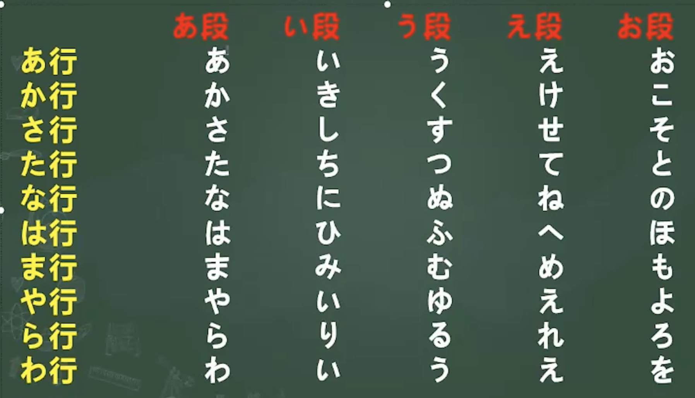
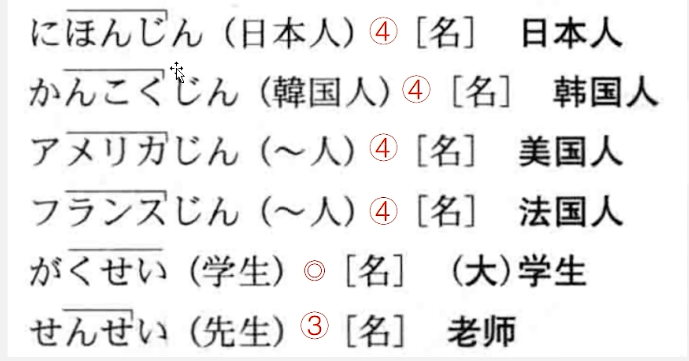
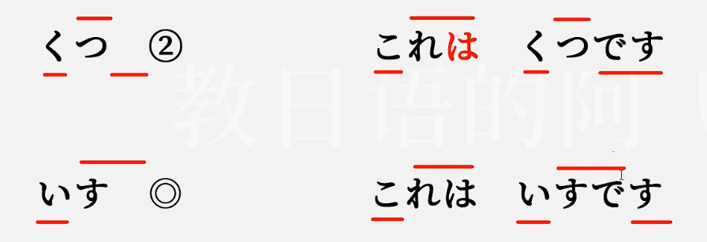
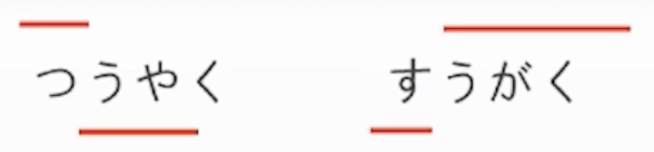
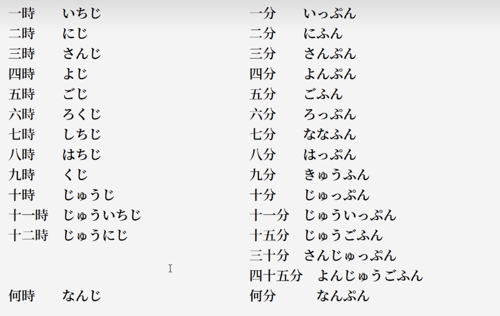
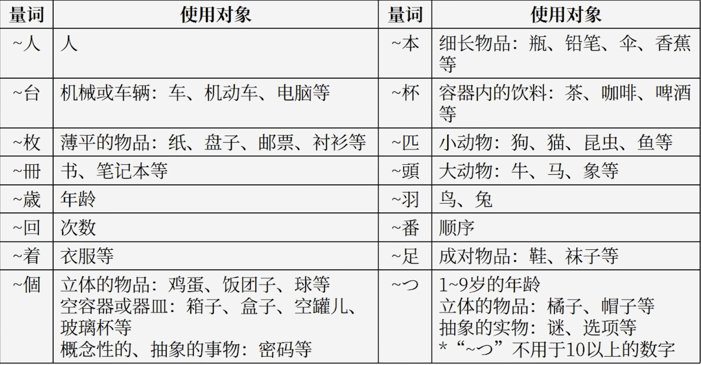

# 音

## 五十音

### 清音

- **ふ写作 hu ，发音为 fu**

### 浊音

- **じ写作 zi / ji ，发音为ji**

- **ぢ写作di，发音为ji**

- **づ写作du，发音为zu**

  > **ぢ/づ分别与じ/ず发音相同。**

### 拗音

> 清音对应的浊音，也可发出坳音，如しょ/じょ、きゃ/ぎゃ。

 

## 声调

**规律**：

- **单词的第1个音和第2个音是不同音的**
- **单词出现降音后，不会升回去**
- **在第几个音出现【高 -> 低】，就是几型**
- 除了1型外，第一个音均为低音

> - **坳音在声调计算时，只算一个音**
> - **ん在声调计算时，单独算一个音**

**0型和N型的区别**（N>1）

当单词只有N个音时，**0型和N型在单词上的发音没有区别**，只有在句子里面中，才能体现出区别。

> 以0型与2型为例：
>
> 

-  N型：句子里接着此单词的后一个音，要变成低音
- 0型：句子里接着此单词的后一个音，要变成高音

## 长音

**长音：将原发音拉长，不发出长音字符本身的音**。

> **长音字符本身也算单个发音，在声调计算时，也需要计算进去。**如：
>
> 
>
> 
>
> 坳音根据为ゃ、ゅ、ょ，长音规则为对应的あ、う、お段。

**平假名长音：**

- **あ段假名+あ**

  かあ、さあ、たあ、なあ、はあ、まあ、やあ、らあ、わあ，以及对应浊音，均为长音。

  > 例子：おかあさん、おばあさん。

- **い段假名 + い**

  きい、しい、ちい、にい、ひい、みい、りい，以及对应浊音，均为长音。

  > 例子：おにいさん、おじいさん、ちいさい。

- **う段假名 + う**

  くう、すう、つう、ぬう、ふう、むう、ゆう、るう，以及对应浊音，均为长音。

  **すう、つう等属于u段但是又不发u音的，不要发出u音，仅仅将原发音拉长。**

  > 例子：つうやく、すうがく、ゆうき、ゆうじん。

- **え段假名+ え / い**

  え段假名+ え 或 い都属于长音。 

  > 例子：おねえさん、せんせい、へいわ。

- **お段假名+ お / う**

  お段假名+ お 或 う都属于长音。 

  > 例子：おとうさん、おおきい、のうみん、のうさん、きょう。

**片假名长音：ー。所有片假名的长音字符都为"ー"。**

## 促音

日语中的促音是一种特殊的音素，表示在发音时暂停一下后再发出下一个音节。**促音符号是っ**。

促音也算单个发音，在声调声型计算时，参与计算。

> 例子：
>
> - かっこいい
> - きっと
> - いってきます
> - きっかり

# 单词

## 一：小李是中国人

| 单词         | 假名               | 声调  | 词义                  |
| ------------ | ------------------ | ----- | --------------------- |
| 中国人       | ちゅうごくじん     | ４    |                       |
| 日本人       | にほんじん         | 4     |                       |
| 韓国人       | かんこくじん       | 4     |                       |
| アメリカ人   |                    | 4     | 美国人                |
| フランス人   |                    | 4     | 法国人                |
| 学生         | がくせん           | ０    |                       |
| 留学生       | りゅうがくせん     | ３    |                       |
| 教授         | きょうじゅ         | ０    |                       |
| 社員         | しゃいん           | １    | 职员                  |
| 会社員       | かいしゃいん       | ３    | 公司职员              |
| 店員         | てんいん           | ０    |                       |
| 研修生       | けんしゅうせん     | ３    | 进修生                |
| 企業         | きぎょう           | 1     | 企业                  |
| 大学         | だいがく           | ０    |                       |
| 父           | ちち               | １/２ | 父亲                  |
| 課長         | かちょう           | ０    | 科长                  |
| 社長         | しゃちょう         | 0     | 总经理                |
| 出迎え       | でむかえ           | ０    | 迎接                  |
| 私           | わたし             | ０    | 我                    |
| あなた       |                    | ２    | 你                    |
| どうも       |                    | １    | 非常、很              |
| いいえ       |                    | ３    | 不                    |
| 中国         | ちゅうごく         | 1     |                       |
| 東京大学     | とうきょうだいがく | ５    |                       |
| 企画         | きかく             | 0     | 策划                  |
| 旅行         | りょこう           | ０    |                       |
| 商事         | しょうじ           | １    | 商务、商业            |
| どうぞ       |                    | １    | 请                    |
| ～さん       |                    |       | 先生、小姐            |
| 〜くん       |                    |       | 先生/小姐（年幼叫法） |
| 初めまして   | はじめまして       | ４    | 初次见面              |
| こちらこそ   |                    | ４    | 我才要                |
| そうです     |                    | １    | 是（这样）            |
| 違います     | ちがいます         | ４    | 不是                  |
| わがりません |                    | ５    | 不知道                |

**姓氏**

日本的姓氏80%都是0型，而中文/英文姓氏基本都为1型。

| 单词       | 假名     | 声调 | 词义   |
| ---------- | -------- | ---- | ------ |
| 王         | おう     | １   |        |
| 森         | もり     | ０   |        |
| 林         | はやし   | ０   |        |
| 小野       | おの     | ０   |        |
| 吉田       | よした   | ０   |        |
| 田中       | たなか   | ０   |        |
| 中村       | なかむら | ０   |        |
| 太朗       | たろう   | １   |        |
| 佐藤       | さとう   | １   |        |
| 髙橋       | たかはし | ２   |        |
| 金         | キム     | １   |        |
| デゅポン   |          | １   | 迪蓬   |
| スミス     |          | １   | 史密斯 |
| ジョンソン |          | １   | 约翰逊 |

## 二：这是书

| 单词     | 假名         | 声调 | 词义                 |
| -------- | ------------ | ---- | -------------------- |
| 本       | ほん         | 1    | 书                   |
| がばん   |              | ０   | 包、公文包           |
| ノート   |              | １   | 笔记本               |
| 鉛筆     | えんぴつ     | ０   |                      |
| 傘       | かさ         | １   |                      |
| 靴       | くつ         | ２   | 鞋                   |
| 新聞     | しんぶん     | ０   | 报纸                 |
| 雑誌     | ざっし       | ０   | 杂志                 |
| 辞書     | じしょ       | １   | 辞典                 |
| カメラ   |              | １   | 照相机               |
| テレビ   |              | １   | 电视                 |
| パソコン |              | ０   | 电脑                 |
| ラジオ   |              | １   | 收音机               |
| 電話     | でんわ       | ０   |                      |
| 机       | つくえ       | ０   | 桌子                 |
| 椅子     | いす         | ０   |                      |
| 鍵       | かぎ         | ２   | 钥匙                 |
| 時計     | とけい       | ０   | 钟、表               |
| 手帳     | てちょう     | ０   | 记事本               |
| 写真     | しゃしん     | ０   | 照片                 |
| 車       | くるま       | ０   |                      |
| 自転車   | じてんしゃ   | ０   |                      |
| お土産   | おみやげ     | ０   | 礼物                 |
| 名産品   | めいさんひん | ０   | 特产                 |
| シルク   |              | 1    | 丝绸（silk）         |
| ハンカチ |              | 0    | 手绢（handkerchief） |
| 会社     | かいしゃ     | ０   | 公司                 |
| 方       | かた         | ２   | （尊称）位、人       |
| 人       | ひと         | ０   | 人                   |
| 家族     | かぞく       | １   | 家人、家属           |
| 母       | はは         | １   | （我）母亲           |
| お母さん | おかあさん   | ２   | 母亲                 |
| 日本語   | にほんご     | ０   | 日语                 |
| これ     |              | ０   | 这、这个             |
| それ     |              | ０   | 那、那个             |
| あれ     |              | 0    | 那、那个             |
| どれ     |              | 1    | 哪个                 |
| 何       | なん         | 1    | 什么                 |
| だれ     |              | 1    | 谁                   |
| どなた   |              | 1    | 哪位                 |
| この     |              | 0    | 这个（连接名词）     |
| その     |              | 0    | 那个（连接名词）     |
| あの     |              | 0    | 那个（连接名词）     |
| どの     |              | １   | 哪个（连接名词）     |
| 長島     | ながしま     | ０   | 长岛                 |
| ロンドン |              | １   | 伦敦                 |
| おいくつ |              | ０   | 年纪多大             |

## 三：这是商场

| 单词           | 假名               | 声调 | 词义                         |
| -------------- | ------------------ | ---- | ---------------------------- |
| デパート       |                    | 2    | 百货商店（department store） |
| 食堂           | しょくどう         | ０   |                              |
| 郵便局         | ゆうびんきょく     | ３   | 邮局                         |
| 銀行           | ぎんこう           | ０   |                              |
| 図書館         | としょかん         | ２   |                              |
| マンション     |                    | １   | （高级）公寓（mansion）      |
| ホテル         |                    | １    | 宾馆（hotel）                |
| コンビニ       |                    | ０    | 便利店（convenience store）  |
| 喫茶店         | きっさてん         | ０    | 咖啡馆                       |
| 病院           | びょういん         | ０    | 医院                         |
| 本屋           | ほんや             | １    | 书店                         |
| レストラン     |                    | １   | 餐馆、西餐馆（restaurant）   |
| ビル           |                    | 1    | 大厦（build）                |
| 建物           | たてもの           | ２   | 大楼、建筑物                 |
| 売り場         | うりば             | ０   | 柜台、出售处                 |
| トイレ         |                    | １   | 厕所（toilet）               |
| お手洗い       | おてあらい         | 4    | 厕所                         |
| 入り口         | いりくち           | ０   | 入口                         |
| 事務所         | じむしょ           | ２   |                              |
| 受付           | うけつけ           | ０   | 接待处                       |
| バーゲン会場   | バーゲンかいじょう | ４   | 降价处理大卖场（bargain）    |
| 服             | ふく               | ０   | 衣服                         |
| エスカレーター |                    | ４   | 自动扶梯（escalator）        |
| コート         |                    | １   | 大衣（coat）                 |
| デジカメ       |                    | ０   | 数码相机（digital camera）   |
| 国             | くに               | ０   | 国家                         |
| 地図           | ちず               | １   | 地图                         |
| 隣             | となり             | ０   | 旁边                         |
| 周辺           | しゅうへん         | ０   | 附近、周边                   |
| 今日           | きょう             | １   | 今天                         |
| 月曜日         | げつようび         | ３   | 周一                         |
| 火曜日         | かようび           | ２   | 周二                         |
| 水曜日         | すいようび         | ３   | 周三                         |
| 木曜日         | もくようび         | ３   | 周四                         |
| 金曜日         | きんようび         | ３   | 周五                         |
| 土曜日         | どようび           | ２   | 周六                         |
| 日曜日         | にちようび         | ３   | 周日                         |
| ここ           |                    | 0    | 这里                         |
| そこ           |                    | 0    | 那里                         |
| あそこ         |                    | 0    | 那里                         |
| こちら         |                    | 0    | 这边                         |
| そちら         |                    | 0    | 那边                         |
| あちら         |                    | ０   | 那边                         |
| どこ           |                    | 1    | 哪里                         |
| どちら         |                    | 1    | 哪边                         |
| あのう         |                    | 0    | 请问                         |
| 円             | えん               | １   | 日元/圆                      |
|                |                    |      |                              |

## 四：房间里有桌椅

| 单词           | 假名         | 声调 | 词义                |
| -------------- | ------------ | ---- | ------------------- |
| 部屋           | へや         | ２   | 房间、屋子          |
| 庭             | にわ         | ０   | 院子                |
| 家             | いえ         | ２   |                     |
| 居間           | いま         | ２   | 起居室              |
| 冷蔵庫         | れいぞうこ   | ３   | 冰箱                |
| 壁             | かべ         | ０   | 墙                  |
| スイッチ       |              | ２   | 开关（switch）      |
| 本棚           | ほんだな     | １   | 书架                |
| ベッド         |              | １   | 床（bed）           |
| 猫             | ねこ         | １   |                     |
| 犬             | いぬ         | ２   |                     |
| 箱             | はこ         | ０   | 盒子、箱子          |
| 眼鏡           | めがね       | １   |                     |
| ビデオ         |              | １   | 录像机（vedio）     |
| サッカーボール |              | ５   | 足球（soccer ball） |
| ビール         |              | １   | 啤酒（beer）        |
| ウイスキー     |              | ３   | 威士忌（whisky）    |
| 子供           | こども       | ０   | 孩子                |
| 兄弟           | きょうだい   | １   | 兄弟姐妹            |
| 両親           | りょうしん   | １   | 父母                |
| 妹             | いもうと     | ４   | 妹妹                |
| 男             | おとこ       | ３   |                     |
| 女             | おんな       | ３   |                     |
| 生徒           | せいと       | １   | 学生                |
| 上             | うえ         | ０   | 上面                |
| 外             | そと         | １   | 外面                |
| 中             | なか         | １   | 里面                |
| 下             | した         | ０   | 下面                |
| 前             | まえ         | １   | 前面                |
| 後ろ           | うしろ       | ０   | 后面                |
| 近く           | ちかく       | １   | 附近                |
| 場所           | ばしょ       | ０   | 所在地、地方        |
| 教室           | きょうしつ   | ０   | 教室                |
| 会議室         | かいぎしつ   | ３   |                     |
| 図書室         | としょしつ   | ２   |                     |
| 公園           | こうえん     | ０   |                     |
| 花屋           | はなや       | ２   | 花店                |
| 売店           | ばいてん     | ０   | 小卖部              |
| 駅             | えき         | １   | 车站                |
| 地下鉄         | ちかてつ     | ０   | 地铁                |
| 木             | き           | １   | 树                  |
| 一人暮らし     | ひとりぐらし | ４   | 单身生活            |
| あります       |              | ３   | 有、在（非意志者）  |
| います         |              | ２   | 有、在（有意志者）  |
| 横浜           | よこはま     | ０   |                     |
| 名古屋         | なごや       | １   |                     |
| 大阪           | おおさか     | ０   |                     |

## 五：森先生7点起床

| 单词       | 假名             | 声调 | 词义             |
| ---------- | ---------------- | ---- | ---------------- |
| 今         | いま             | １   | 现在             |
| 先週       | せんしゅう       | ０   | 上周             |
| 来週       | らいしゅう       | ０   | 下周             |
| 再来週     | さらいしゅう     | ０   | 下下周           |
| 今週       | こんしゅう       | ０   | 这周             |
| 昨日       | きのう           | ０   | 昨天             |
| 明日       | あした           | ３   | 明天             |
| 明後日     | あさって         | ２   | 后天             |
| 一昨日     | おととい         | ３   | 前天             |
| 毎日       | まいにち         | １   | 每天             |
| 毎朝       | まいあさ         | １   | 每天早上         |
| 毎晩       | まいばん         | １   | 每天晚上         |
| 毎週       | まいしゅう       | ０   | 每个星期         |
| 午前       | ごぜん           | １   | 上午             |
| 午後       | ごご             | １   | 下午             |
| 今朝       | けさ             | １   | 今天早上         |
| 今晩       | こんばん         | １   |                  |
| 来年       | らいねん         | ０   | 明年             |
| 去年       | きょねん         | １   |                  |
| 夜         | よる             | １   | 晚上、夜里       |
| 晩         | ばん             | ０   | 晚上             |
| 朝         | あさ             | １   | 早上             |
| 学校       | がっこう         | ０   |                  |
| 試験       | しけん           | ２   | 考试             |
| 仕事       | しごと           | ０   | 工作             |
| 遅刻       | ちこく           | ０   | 迟到             |
| 休み       | やすみ           | ０   | 休息             |
| 出張       | しゅっちょう     | ０   | 出差             |
| 研修       | けんしゅう       | ０   | 进修             |
| 旅行       | りょこう         | ０   |                  |
| 展覧会     | てんらんかい     | ３   |                  |
| 歓迎会     | かんげいかい     | ３   |                  |
| パーティー |                  |      | 联欢会（party）  |
| お宅       | おたく           | ０   | 府上、（您）家   |
| いつ       |                  | １   | 什么时候         |
| 休みます   | やすみます       | ４   | 休息（休む）     |
| 働きます   | はたらきます     | ５   | 工作（働く）     |
| 始まります | はじまります     | ４   | 开始（始まる）   |
| 終わります | おわります       | ４   | 结束（終わる）   |
| 起きます   | おきます         | ３   | 起床（起きる）   |
| 寝ます     | ねます           | ２   | 睡觉（寝る）     |
| 勉強します | べんきょうします | ６   | 学习（勉強する） |
| いつも     |                  | １   | 经常             |
| 支社       | ししゃ           | １   | 分社             |
| 神戸       | こうべ           | １   |                  |
| おはよう   |                  | ０   | 早               |

## 六：吉田先生下个月去中国

| 单词             | 假名                   | 声调 | 词义                       |
| ---------------- | ---------------------- | ---- | -------------------------- |
| 来月             | らいげつ               | １   | 下个月                     |
| 先月             | せんげつ               | １   | 上个月                     |
| 夜中             | よなか                 | １   | 午夜、半夜                 |
| 昨夜             | ゆうべ                 | ０   |                            |
| コンサート       |                        | １   | 音乐会（concert）          |
| クリスマス       |                        | ３   | 圣诞节（Christmas）        |
| 誕生日           | たんじょうび           | ３   | 生日                       |
| 子供の日         | こどもの日             | ５   | 儿童节                     |
| 夏休み           | なつやすみ             | ３   | 暑假                       |
| 交通機関         | こうつうきかん         | ５   | 交通工具                   |
| 新幹線           | しんかんせん           | ３   |                            |
| 飛行機           | ひこうき               | ２   | 飞机                       |
| フェリー         |                        | １   | 渡轮（ferry）              |
| 電車             | でんしゃ               | ０   |                            |
| バス             |                        |      | 公共汽车（bus）            |
| タクシー         |                        |      | 出租车（taxi）             |
| 美術館           | びじゅつかん           | ３   |                            |
| アパート         |                        | ２   | 公寓（apart）              |
| うち             |                        | ０   | 家                         |
| プール           |                        | １   | 游泳池（pool）             |
| 友達             | ともだち               | ０   | 朋友                       |
| 弟               | おとうと               | ４   | 弟弟                       |
| 行きます         | いきます               | ３   | 去（行く）                 |
| 帰ります         | かえります             | ４   | 回来（帰る）               |
| 来ます           | きます                 | ２   | 来（来る（くる））         |
| 確か             | たしか                 | １   | 好像是、大概               |
| 真っ直ぐ         | まっすぐ               | ３   | 笔直                       |
| 一緒に           | いっしょに             | ０   | 一起                       |
| アメリカ         |                        | ０   | 美国                       |
| 韓国             | かんこく               | １   |                            |
| フランス         |                        | ０   | 法国                       |
| 広島             | ひろしま               | ０   | 广岛                       |
| 京都             | きょうと               | １   |                            |
| 北海道           | ほっかいどう           | ３   |                            |
| 箱根             | はこね                 | ０   |                            |
| 銀座             | ぎんざ                 | ０   |                            |
| 渋谷             | しぶや                 | ０   | 涩谷                       |
| 新宿             | しんじゅく             | ０   |                            |
| お疲れ様でした   | おつかれさまでした     | ７   | 辛苦了、够累的             |
| お先に失礼します | おさきにしつれいします | 10   | 我先告辞了                 |
| 歩いて           | あるいて               | ２   | 步行（歩いて是歩く的て形） |
| 大変ですね       | たいへんですね         | ５   | 真不容易                   |

## 七：小李每天都喝咖啡

| 单词             | 假名             | 声调 | 词义                 |
| ---------------- | ---------------- | ---- | -------------------- |
| コーヒー         |                  | ３   | 咖啡（coffee）       |
| コーラ           |                  | １   | 可乐（cola）         |
| お茶             | おちゃ           | ０   | 茶                   |
| ワイン           |                  | １   | 葡萄酒（wine）       |
| パン             |                  | １   | 面包（法语pain）     |
| ケーキ           |                  | １   | 蛋糕（cake）         |
| お粥             | おかゆ           | ０   | 粥                   |
| 昼ご飯           | ひるごはん       | ３   | 午饭                 |
| お弁当           | おべんとう       | ０   | 盒饭                 |
| 蕎麦             | そば             | １   | 荞麦面               |
| うどん           |                  | ０   | 乌冬面               |
| 親子丼           | おやこどん       | ０   | 鸡肉鸡蛋盖饭         |
| カレー           |                  | ０   | 咖喱（curry）        |
| 卵               | たまご           | ２   | 鸡蛋                 |
| チーズ           |                  | １   | 干酪（cheese）       |
| リンゴ           |                  | 1    | 苹果                 |
| イチゴ           |                  | 0    | 草莓                 |
| そば屋           | そばや           | ２   | 荞麦面馆             |
| テニス           |                  | １   | 网球（tennis）       |
| ジョギング       |                  | ０   | 慢跑（jogging）      |
| サッカー         |                  | １   | 足球（soccer）       |
| 野球             | やきゅう         | ０   | 棒球                 |
| 申込書           | もうしこみしょ   | ６   | 申请书               |
| 手紙             | てがみ           | ０   | 信                   |
| シーディー       |                  | ３   | CD                   |
| 音楽             | おんがく         | １   |                      |
| 映画             | えいが           | ０   | 电影                 |
| 動物園           | どうぶつえん     | ４   |                      |
| パンダ           |                  | １   | 熊猫（panda）        |
| 飲みます         | のみます         | ３   | 喝（飲む）           |
| 買います         | かいます         | ３   | 买（買う）           |
| 撮ります         | とります         | ３   | 拍照（撮る）         |
| 書きます         | かきます         | ３   | 写（書く）           |
| 読みます         | よみます         | ３   | 读（読む）           |
| 聞きます         | ききます         | ３   | 听（聞く）           |
| 食べます         | たべます         | ３   | 吃（食べる）         |
| 見ます           | みます           | ２   | 看（見る）           |
| します           |                  | ２   | 干、做（する）       |
| 掃除します       | そうじします     | ５   | 打扫（掃除する）     |
| これから         |                  | ０   | 从现在起             |
| じゃあ           |                  | １   | 那么                 |
| いらっしゃいませ |                  | ６   | 欢迎光临             |
| 失礼します       | しつれいします   | ２   | 打扰一下（失礼しる） |
| 失礼しました     |                  | ２   | 打搅了（失礼しる）   |
| 行ってまいります | いってまいります | ７   | 我走了               |
| 行ってきます     |                  | ５   | 我走了               |
| 行ってらっしゃい |                  | ６   | 你走好               |
| ただいま         |                  | ４   | 我回来了             |
| お帰りなさい     | おかえりなさい   | ６   | 欢迎回来             |
| かしこまりました |                  | ６   | 我知道了             |
| お邪魔します     | おじゃまします   | ５   | 打扰了（邪魔する）   |
| ください         |                  | ３   | 给我                 |
| 午前中           | ごぜんちゅう     | ０   | 上午                 |

## 八：小李用日语写信

| 单词           | 假名               | 声调 | 词义                   |
| -------------- | ------------------ | ---- | ---------------------- |
| プレゼント     |                    | ２   | 礼物（present）        |
| チケット       |                    | １   | 票（ticket）           |
| パンフレット   |                    | １   | 小册子（pamphlet）     |
| 記念品         | きねんひん         | ０   |                        |
| スケジュール表 | スケジュールひょう | ０   | 日程表（schedule）     |
| 写真集         | しゃしんしゅう     | ２   | 影集                   |
| 花             | はな               | ２   |                        |
| お金           | おかね             | ０   | 金钱                   |
| ボールペン     |                    | ０   | 圆珠笔（ball pen）     |
| 宿題           | しゅくだい         | ０   | 作业                   |
| 航空便         | こうくうびん       | ０   | 航空邮件               |
| 速達           | そくたつ           | ０   | 速递                   |
| ファックス     |                    | １   | 传真（fax）            |
| メール         |                    | ０   | 邮件（mail）           |
| 電話番号       | でんわばんごう     | ４   | 电话号码               |
| 住所           | じゅうしょ         | １   |                        |
| 名前           | なまえ             | ０   | 姓名                   |
| 件             | けん               | １   | 事件                   |
| 新聞紙         | しんぶんし         | ３   | 报纸                   |
| 紙飛行機       | かみひこうき       | ４   | 纸飞机                 |
| チョコレート   |                    | ３   | 巧克力（chocolate）    |
| アイスクリーム |                    | ５   | 冰激凌（ice cream）    |
| 小麦粉         | こむぎこ           | ０   | 面粉                   |
| 箸             | はし               | １   | 筷子                   |
| スパーン       |                    | ２   | 勺子（spoon）          |
| お兄さん       | おにいさん         | ２   | 哥哥                   |
| 韓国語         | かんこくご         | ０   | 韩语                   |
| 夕方           | ゆうがた           | ０   | 傍晚                   |
| 昼休み         | ひるやすみ         | ３   | 午休                   |
| 貰います       | もらいます         | ４   | 拿到（貰う）           |
| 会います       | あいます           | ３   | 见（会う）             |
| 送ります       | おくります         | ４   | 寄（送る）             |
| 作ります       | つくります         | ４   | 做（作る）             |
| 太ります       | ふとります         | ４   | 胖（太る）             |
| 出します       | だします           | ３   | 寄（信）（出す）       |
| 届きます       | とどきます         | ４   | 收到（届く）           |
| 描きます       | かきます           | ３   | 画（描く）             |
| 貸します       | かします           | ３   | 借给（貸す）           |
| 習います       | ならいます         | ４   | 学习（習う）           |
| あげます       |                    | ３   | 给（あげる）           |
| かけます       |                    | ３   | 打（电话）（かける）   |
| 借ります       | かります           | ３   | （向别人）借（借りる） |
| 教えます       | おしえます         | ４   | 教（教える）           |
| もう           |                    | １   | 已经                   |
| さっき         |                    | １   | 刚才                   |
| たった今       | たったいま         | ４   | 刚刚                   |
| もう一度       | もういちど         | ０   | 再一次                 |
| 前に           | まえに             | １   | 以前                   |
| 陳             | ちん               | １   |                        |
| どうですか     |                    | １   | 如何                   |
| お願いします   |                    | ６   | 拜托了                 |
| 分かりました   | わかりました       | ４   | 明白了                 |
| よかったです   |                    | １   | 太好了                 |
| 〜様           | さま               |      |                        |

## 九：四川料理

| 单词           | 假名                 | 声调   | 词义                     |
| -------------- | -------------------- | ------ | ------------------------ |
| 料理           | りょうり             | １     |                          |
| スープ         |                      | １     | 汤（soup）               |
| ぺきんダック   |                      | ４     | 北京烤鸭（beijing duck） |
| 食べ物         | たべもの             | ３     | 食物                     |
| すき焼き       | すきやき             | ０     | 日式牛肉火锅             |
| 温泉           | おんせん             | ０     |                          |
| お湯           | おゆ                 | ０     | 热水                     |
| 水             | みず                 | ０     | 凉水                     |
| 浴衣           | ゆかた               | ０     |                          |
| 眺め           | ながめ               | ０     | 景色                     |
| 薬             | くすり               | ０     |                          |
| 天気           | てんき               | １     |                          |
| 海             | うみ                 | １     |                          |
| 山             | やま                 | ２     |                          |
| 紙             | かみ                 | ２     |                          |
| ニュース       |                      | １     | 新闻（news）             |
| 女性           | じょせい             | ０     |                          |
| お客様         | おきゃくさま         | ４     | 来宾                     |
| グラス         |                      | １     | 玻璃杯（glass）          |
| 歌舞伎         | かぶき               | ０     |                          |
| 気持ち         | きもち               | ０     | 心情                     |
| たくさん       |                      | ３     | 很多                     |
| 辛い           | からい               |        | 辣                       |
| 甘い           | あまい               |        | 甜                       |
| 塩辛い         | しおからい           |        | 咸                       |
| 酸っぱい       | すっぱい             |        | 酸                       |
| 苦い           | にがい               |        | 苦                       |
| 美味しい       | おいしい             |        | 好吃                     |
| まずい         |                      |        | 难吃                     |
| 熱い           | あつい               |        | 热                       |
| 冷たい         | つめたい             |        | 凉                       |
| 楽しい         | たのしい             |        | 愉快                     |
| 面白い         | おもしろい           |        | 有趣                     |
| つまらない     |                      | ３     | 无聊                     |
| 広い           | ひろい               |        | 广阔                     |
| 狭い           | せまい               |        | 狭窄                     |
| 大きい         | おおきい             |        | 大                       |
| 小さい         | ちいさい             |        | 小                       |
| 忙しい         | いそがしい           |        | 忙                       |
| いい           |                      | 1      | 好                       |
| 悪い           | わるい               |        | 不好                     |
| 素晴らしい     | すばらしい           |        | 极好                     |
| 遠い           | とおい               |        | 远                       |
| 近い           | ちかい               |        | 近                       |
| 高い           | たかい               |        | 高、贵                   |
| 低い           | ひくい               |        | 低                       |
| 安い           | やすい               |        | 便宜                     |
| 寒い           | さむい               |        | 寒冷                     |
| 暑い           | あつい               |        | （天气）热               |
| 青い           | あおい               |        | 蓝色的                   |
| 白い           | しろい               |        | 白色的                   |
| 新しい         | あたらしい           |        | 新                       |
| 古い           | ふるい               |        | 旧                       |
| 難しい         | むずかしい           |        | 难                       |
| 易しい         | やさしい             |        | 容易                     |
| 多い           | おおい               |        | 多                       |
| 少ない         | すくない             |        | 少                       |
| 可愛い         | かわいい             |        | 可爱                     |
| 本当に         | ほんとうに           | 0      | 真的                     |
| あまり         |                      | ０     | 不（太）～～             |
| とても         |                      | ０     | 很、非常                 |
| 少し、ちょっと | すこし               | ２、１ | 一点                     |
| 全然           | ぜんぜん             | ０     | 根本                     |
| ちょうど       |                      | ０     | 正好                     |
| あら、あれ     |                      | １     | 哎呀                     |
| 天安門         | てんあんもん         | ３     | 天安门                   |
| 万里の長城     | ばんりのちょうじょう |        | 万里长城                 |
| 気持ちがいい   |                      |        | 感觉舒服                 |

**い形容词绝大多音调都是“低高低”，结尾的“い”变为低音**，即为2型、3型、4型等。

上面中没标注音调的形容词，均可读作低高低。

## 十：京都的红叶很有名

| 单词     | 假名               | 声调 | 词义             |
| -------- | ------------------ | ---- | ---------------- |
| 紅葉     | もみじ             | １   |                  |
| 故郷     | こきょう           | １   |                  |
| 通り     | とおり             | ３   | 大街             |
| 町       | まち               | ２   | 城市、街道       |
| 所       | ところ             | ３   | 场所             |
| お店     | おみせ             | ０   | 商店             |
| 人形     | にんぎょう         | ０   | 玩偶             |
| 作品     | さくひん           | ０   | 作品             |
| 彫刻     | ちょうこく         | ０   | 雕刻             |
| 自動車   | じどうしゃ         | ２   | 汽车             |
| 道具     | どうぐ             | ３   | 工具             |
| 魚       | さかな             | ０   |                  |
| お菓子   | おかし             | ２   | 点心             |
| 物       | もの               | ２   | 物品             |
| シーズン |                    | １   | 季节（season）   |
| 修学旅行 | しゅうがくりょこう | ５   |                  |
| 観光客   | かんこうきゃく     | ３   | 游客             |
| 作家     | さっか             | ０   |                  |
| 部長     | ぶちょう           | ０   |                  |
| 平日     | へいじつ           | ０   | 工作日           |
| 日       | ひ                 |      | 日子             |
| 生活     | せいかつ           | ０   |                  |
| 世界     | せかい             | １   |                  |
| 晴れ     | はれ               | ２   | 晴天             |
| 雨       | あめ               | １   |                  |
| 曇り     | くもり             | ３   | 阴天             |
| 雪       | ゆき               | ２   |                  |
| 汚い     | きたない           | ３   | 脏               |
| 綺麗     | きれい             | １   | 漂亮、干净       |
| 有名     | ゆうめい           | ０   |                  |
| 賑やか   | にぎやか           | ２   | 热闹             |
| 静か     | しずか             | １   | 安静             |
| 暇       | ひま               | ０   | 空闲             |
| 親切     | しんせつ           | １   | 热情             |
| 好き     | すき               | ２   | 喜欢             |
| 嫌い     | きらい             | ０   | 讨论             |
| 便利     | べんり             | １   | 方便             |
| 不便     | ふべん             | １   | 不方便           |
| 元気     | げんき             | １   | 健康             |
| 簡単     | かんたん           | ０   |                  |
| ハンサム |                    | １   | 英俊（handsome） |
| どんな   |                    | １   | 什么样的         |
| どう     |                    | １   | 怎样             |
| いかが   |                    | ２   | 如何             |
| いろいろ |                    | ０   | 各种各样         |
| でも     |                    | １   | 可是             |
| そして   |                    | ０   | 而且             |
| ところで |                    |      | 转移话题         |
| 奈良     | なら               | １   |                  |
| 富士山   | ふじさん           | １   |                  |
| もう少し | もうすこし         | ４   | 再～～一点       |
| 〜中     | 〜じゅう           |      |                  |

## 11：小野喜欢唱歌

| 单词               | 假名         | 声调 | 词义                    |
| ------------------ | ------------ | ---- | ----------------------- |
| 歌                 | うた         | ２   | 歌曲                    |
| カラオケ           |              | ０   | 卡拉OK                  |
| ロック             |              | １   | 摇滚乐（Rock）          |
| ポップス           |              | １   | 流行音乐（pops）        |
| クラシック         |              | ３   | 西方古典音乐（classic） |
| ピアノ             |              | ０   | 钢琴（piano）           |
| 絵                 | え           | １   | 画                      |
| 英語               | えいご       | ０   | 英语                    |
| スペイン語         |              |      | 西班牙语（spain）       |
| スポーツ           |              |      | 体育（sport）           |
| 水泳               | すいえい     | ０   | 游泳                    |
| ゴルフ             |              | １   | 高尔夫（golf）          |
| 運転               | うんてん     | ０   | 开车                    |
| 飲み物             | のみもの     | ２   | 饮料                    |
| お酒               | おさけ       | ０   | 酒                      |
| 肉                 | にく         | ２   | 肉                      |
| 野菜               | やさい       | ０   | 蔬菜                    |
| 果物               | くだもの     | ２   | 水果                    |
| ヒマワリ（向日葵） |              | ２   | 向日葵                  |
| バラ（薔薇）       |              | ０   | 玫瑰                    |
| コンピューター     |              | ３   | 电脑（computer）        |
| 窓                 | まど         | １   | 窗户                    |
| 結婚式             | けっこんしき | ３   | 结婚典礼                |
| 写真展             | しゃしんてん | ２   | 摄影展                  |
| 旅館               | りょかん     | ０   | 旅馆                    |
| 別荘               | べっそう     | ３   | 别墅                    |
| 寄木細工           | よせぎざいく | ４   | 木片拼花工艺品          |
| 模様               | もよう       | ０   | 花纹                    |
| 外国               | がいこく     | ０   | 外国                    |
| 会議               | かいぎ       | １   | 会议                    |
| 脚                 | あし         | ２   | 腿                      |
| 僕                 | ぼく         | １   | 我                      |
| 分かります         | わかります   |      | 明白（分かる）          |
| 迷います           | まよいます   |      | 犹豫（迷う）            |
| できます           |              |      | 会（できる）            |
| 閉めます           | しめます     |      | 关闭（閉める）          |
| 疲れます           | つかれます   |      | 疲倦（疲れる）          |
| 散歩します         | さんぽします |      | 散步（散歩する）        |
| 怖い               | こわい       |      | 害怕                    |
| 赤い               | あかい       |      | 红                      |
| 痛い               | いたい       |      | 疼痛                    |
| 上手               | じょうず     | ３   | 擅长                    |
| 下手               | へた         | ２   | 水平低                  |
| 苦手               | にがて       | ０   | 不擅长                  |
| 時々               | ときどき     | ０   | 有时                    |
| よく               |              | １   | 经常                    |
| たまに             |              | ０   | 偶尔                    |
| また               |              | ０   | 再                      |
| どうして           |              | １   | 为什么                  |
| だから             |              | １   | 所以                    |
| うーん             |              |      | 嗯···                   |
| 結構です           | けっこうです | １   | 不用                    |
| 気に入ります       | きにいります |      | 喜欢（気に入る）        |
| など               |              |      | 等等                    |

## 12：小李比小森林年轻

| 单词            | 假名           | 声调              | 词义                     |
| --------------- | -------------- | ----------------- | ------------------------ |
| 季節            | きせつ         | １                |                          |
| 春              | はる           | １                |                          |
| 夏              | なつ           | ２                |                          |
| 秋              | あき           | １                |                          |
| 冬              | ふゆ           | ２                |                          |
| 日本料理        | にほんりょうり | ４                |                          |
| 寿司            | すし           | ２                |                          |
| ナシ            |                | ２                | 梨                       |
| バナナ          |                | 1                 | 香蕉（banana）           |
| ミカン          |                | １                | 橘子                     |
| 焼酎            | しょうちゅう   | ３                | 烧酒                     |
| 日本酒          | にほんしゅ     | ０                |                          |
| 紅茶            | こうちゃ       | ０                |                          |
| ウーロン茶      |                | ３                | 乌龙茶                   |
| ジャスミン茶    |                | ３                | 茉莉花茶（jasmine）      |
| 緑茶            | りょくちゃ     | ０                |                          |
| ジュース        |                | １                | 果汁（juice）            |
| 人気            | にんき         | ０                | 声望                     |
| 席              | せき           | １                | 座位                     |
| クラス          |                | １                | 班级（class）            |
| 種類            | しゅるい       | １                |                          |
| 背              | せ             | １                | 个子                     |
| 兄              | あに           | １                | 哥哥                     |
| 最近            | さいきん       | ０                |                          |
| 降ります        | ふります       | ３                | 下（雨、雪）（降りる）   |
| 若い            | わかい         | ２                | 年轻                     |
| 暖かい          | あたたかい     |                   | 暖和（）                 |
| 涼しい          | すずしい       |                   | 凉爽                     |
| 速い            | はやい         |                   | 快                       |
| 大好き          | だいすき       | １                | 非常喜欢                 |
| いちばん        |                | ０（形）/２（名） | 最～（形）、第一（名詞） |
| ずっと          |                | ０                | ～得多                   |
| やはり/やっぱり |                | ２/３             | 仍然、还是               |
| チュモランマ    |                | ３                | 珠穆朗玛峰               |
| 人気があります  |                |                   | 受欢迎                   |
| 〜年間          |                |                   | ～年中                   |

## 13：桌子上有三本书

| 单词                  | 假名       | 声调 | 词义                         |
| --------------------- | ---------- | ---- | ---------------------------- |
| 荷物                  | にもつ     | １   | 包裹                         |
| はがき                |            | ０   | 明信片                       |
| 切手                  | きって     | ０   | 邮票                         |
| 引き出し              | ひきだし   | ０   | 抽屉                         |
| アルバム              |            | ０   | 相册（album）                |
| タバコ                |            | ０   | 烟、烟草（tobacco）          |
| 漫画                  | まんが     | ０   |                              |
| ガレージ              |            | ２   | 车库（garage）               |
| 修理                  | しゅうり   | １   |                              |
| 生ビール              | なまビール | ３   | 生啤                         |
| 焼き鳥                | やきとり   | ０   | 烧鸟肉串                     |
| 唐揚げ                | からあげ   | ０   | 炸鸡                         |
| 肉じゃが              | にくじゃが | ０   | 土豆炖肉                     |
| ボーリング            |            | ０   | 保龄球                       |
| 髪                    | かみ       | ２   | 头发                         |
| 象                    | ぞう       | １   |                              |
| 昼                    | ひる       | ２   | 白天、中午                   |
| ほか                  | ほか       | ０   | 另外                         |
| かかります            |            |      | 花费（时间、金钱）（かかる） |
| 咲きます              | さきます   |      | 花开（咲く）                 |
| 泳ぎます              | およぎます |      | 游泳（泳ぐ）                 |
| 遊びます              | あそびます |      | 玩（遊ぶ）                   |
| 吸います              | すいます   |      | 吸（吸う）                   |
| 切ります              | きります   |      | 剪、切（切る）               |
| 大体                  | だいたい   | ０   | 大约、大概                   |
| とりあえず            |            | ３   | 暂且                         |
| どのぐらい/どれぐらい |            | ０   | 多久、多少钱                 |

# 语法

## 一：小李是中国人

***名は名です***

相当于汉语“～是～” 。 ”〜は”是主语部分， ”名詞です”是谓语部分。「です」是助动词。

**中文/英文都采用主谓宾，而日文采用主宾谓。**

**同时日文中有大量的助词，日语属于黏着语，每个单词或者从句在句中做的成分可以由它后面跟的助词进行判断。**

**助间“は”用于提示主题（即は前的名称），读做“わ”。**

> 例句：
>
> - 李さんは中国人です。

***名は名ではありません***

相当于汉语“～不是～” 。 “ではありません”是谓语部分。”ではありません“中的“では”在口语中有时会变成“じゃ”。

> 例句：
>
> - 森さんは学生ではありません。

***名は名ですか***

相当于汉语“～是～吗？” 。 **”か”在句尾表示疑问。日语的疑问句在句尾不使用“？”**。

此时“か”的声调要高。

> 例句：
>
> - あんたは小野さんですか。
>
>   はい，小野です。

**"〜ですか"也可以表示感叹，此时“か”的声调要低。**

> 例句：
>
> - A：ここは大学ですか。
>
>   B：ここは大学です。
>
>   A：大学ですか。
>
> - そですか。（原来是这样）

***名の名***

**助词”の“连接名词和名词，表示所属。**

一般情况下等于汉语中“的”。

> 例句：
>
> - 李さんは中国の社員です。
> - デゅポンさんは大学の先生です。

***人称***

 **1)あなた**

在不知道别人的名字而必须招呼的时候，才会使用第二人称“あなた”。因为使用“あなた”，有时会显得不礼貌。

**2)さん**

称呼别人时，不分男女，都在其姓后面加上“さん”。注意只能用于他人的姓名后，不可用于自己的。

***省略***

省略在日文中是很常用的。 

> - （あなたは）吉田さんでか。
>
>   いいえ，（わたしは）吉田じゃありません。（わたしは）森です。

***寒暄语***

どうぞ　 よろしく　お願いします。相当于“请多关照”。常用“こちらこそ”回复。

> - はじめまして，李です。どうぞ　よろしく　お願いします。
>
>   こちらこそ。

## 二：这是书

***これ/それ/あれ は名です***

**1)面对面谈话时**

- これ：距离说话人较近的事物
- それ：距离听话人较近的事物
- あれ：距离听话人和说话人都较远的事物

**2)说话人与听话人位于同一位置，面向同一方向谈话**

- これ：距离二人较近的事物
- それ：距离二人较远的事物
- あれ：距离二人更远的事物

> 例句：
>
> - これはかばんです。

***誰ですか/何ですか***

即“是谁”/“是什么”。指人时用“誰”，指物时用“何”。

“誰”比较礼貌的说法是“どなた”。”誰”通常用于对方与自己地位相当或较低时。

> 例句：
>
> - あの人は誰です。

　

***この/その/あの***

修饰名词时，要用”この/その/あの“。位置关系与上面相同。

>  例句：
>
> - このカメラはスミスさんの（カメラ）です。（这个照相机是史密斯先生的）
> - このスマホは李さんのです。（这个手机是李先生的）

***どれ/どの***

“どれ/どの”是在三个以上的事物中，不确定是哪一个使用的。

单独使用时使用”どれ”，修饰名词时使用”どの”。

**”この/その/あの/どの"必须连接名词，不可省略。**

>  例句：
>
> - 長島さんの傘はどれですか。
> - 小野さんの机はどの机ですか。

## 三：这是商场

***名は名（場所）です***

当后面的名词为场所时，表示前面的名词位于此场所。

> 例句：
>
> - 食堂はデパートの七階です
> - トイレはここです
> - 小野さんは事務所です　（小野女士在事务所）

***名はどこですか***

即“〜在哪里”。

> 例句：
>
> - あなたのかばんはどこですか。
>
>   ここです

***名も名です***

**助词“も”，相当于汉语中的“也”。**

> 例句：
>
> - ここはJC企画のビルです。
>
>   あそこもJC企画のビルです。
>
> - （あなたも）中国人ですか。

***名は名ですか、名ですか***

答案有多种可能，而询问其中的一种时，可以重复使用谓语”〜ですか”。

> 例句：
>
> - かばん売り場は一階ですか、二階ですか、三階ですか。
> - 今日は水曜日ですか、木曜日ですか。
> - 中村さんは医者ですか、教師ですか。

***名はいくらですか***

即”～多少钱“。

> 例句：
>
> - これはいくらですか
> - その服はいくらですか

***こちら/ここ***

”こちら”比”ここ”更有礼貌、更正式。　あちら、どちら同理。

どちら还可以表示人，如：どちらさまですか（您是哪位？）。

***省略词***

日文中某些外来词，由于过长，从而进行了缩写。

> 例子：
>
> パソコン、コンビニ、デジカメ

## 四：房间里有桌椅

***存在句：あります/います***

- ”あります”用于花、草、桌子等不具有意志的事物。
- ”います”用于人、动物等有意志的事物。

**名「場所」に　名「物」が　あります/います。即：“某地有某物”。**

> 例句：
>
> - 部屋に　机が　あります。
> - ここに　本が　あります。
> - 庭に　何が　ありますか。
>
> 
>
> - 部屋に　猫が　ります。
> - 公園に　子供が　ります。
> - あそこに　誰が　りますか。

***名「物」は　名「場所」に　あります/います*。即：“某物在某地”。**

> 例句：
>
> - 椅子は　部屋に　あります。
> - 図書館は　どこに　ありますか。
> - 吉田さんは　庭に　います。

“名は　どこですか”可替换成“名は　どこに　ありますか/いますか”。但“どこですか“更常用。

***名と名***

助词“と” 加在两个名词之间表示并列，意思相当于汉语的“和”。

> 例句：
>
> - リビングに　テレビど　ビデオが　あります

***方位词：上/下/前/後ろ/隣/中/外***

名の「方位词」

> 例句：
>
> - 机の　上に　猫が　います。
> - 会社の　隣に　花屋が　あります。
> - 売店は　駅の　外に　あります。

***ね***

当说话人就某事征求听话人的同意时，句尾用动词“ね”，读升调。女生常用。

> 例句：
>
> - あそこに　犬が　いますね。
> - 駅の　前に　銀行が　ありますね。 

***全盘否定：疑问句　も　动词（否定）***

> 例句：
>
> - 教室に　誰も　いません
> - 冷蔵庫に　何も　ありま　せん

**表达及词语讲解**

- ”上“表示在平面及平面以上，相当于on + above
- ご家族　ご両親　ご兄弟，通常加上“ご”表示尊敬

## 五：森先生7点起床

***名「時間」に　動詞***

**表示动词的发生时间，要在具体时间词语后加上助词“に”**。

- <u>今、昨日、今日、明日、毎日、去年、来年　不需要加“に”</u>
- 月曜日→日曜日　一般加“に”，也可视情况不加

> 例：
>
> - 森さんは　七時に　起きます。　（时间可前置：七時、森さんは　起きます）
> - 学校は　八時半に　始まります。  （时间可前置：八時半、学校は　始まります）

***名「時間」から　名「時間」まで　動詞***

表示某个时间内都做某个动作。

可以分别使用“名「時間」から”或“名「時間」まで”。

> 例：
>
> - 私は　九時から　五時まで　働きます。
> - 森さんは　月曜日から　水曜日まで　休みました。　（过去形）
> - 王さんは　九時から　働きます。
> - 私は　夜中の２時まで　勉強しました。　（过去形）

***いつ　動詞ますか***

询问什么时候做某事。

<u>可用“何時に”、”何曜日に”、”何日に”替换“いつ”。</u>

> 例：
>
> - 試験は　いつ　始まりますか。
> - 仕事は　何時に　終わりますか。
> - 展覧会は　いつから　始まりますか。
> - 張さんは　何曜日に　休みますか。

**表达及词语讲解**

- 日文中在工作/社团等场合称呼他人时，一般常用职位称呼他人。如“社長”、”部長”、”課長”。

  > 可以职位前加姓氏，如”吉田課長“。

- 名A+名B，<u>假如名词A为“每”时间相关的词（毎朝、毎日，毎週），则这两个名词之间不可以加助词“の”</u>

  > 例：
  >
  > - 毎朝　何時に　起きますか。

- **名「時間」ごろ：表示在此时间左右，且“～ごろ”后不加“に”**

  >  例：
  >
  > - 私は　一時３０分ごろ　学校へ行きます。

## 六：吉田先生下个月去中国

***名「場所」へ　動詞「移动动词」***

表示**以某方式移动到某地**，助词”へ”用于表示目的地。其中动词为“行きます”、“帰ります”等表示移动的动词。

**”へ”做助词时，读作“え”。**

> 例：
>
> - 吉田さんは　中国へ　行きます。
> - 李さんは　どこへ　行きましたか。
> - 昨日、どこへ　行きましたか。

***名「場所」から　動詞「移动动词」***

表示**以某方式从某地移动，助词”から”用于表示起始地。**

> 例：
>
> - 李さんは　先月　北京から　来ました。
> - 彼の方は　どこから　来ましたか。　

***名「人」と　動詞***

表示与某人共同做某事。助词“と”表示共同做某事的对象。

> 例：
>
> - 小野さんは　友達と　帰りました。
> - 李さんは　誰と　日本へ　来ましたか。

　

***名「交通機関」で　動詞***

表示使用交通工具完成某动作。助词“で”表示交通工具。

步行用动词て形“歩いて”表示。

> 例：
>
> - 上海まで　飛行機で　行きます。
> - 私は　バスで　家へ　帰ります。
> - 李さんは　歩いて　アパートへ　帰りました。
> - 京都へ　何で　来ましたか。

***名「場所」から　名「場所」まで　動詞***

表示从某地移动到某地，“から”表示起始地，“まで”表示目的地。

> 例：
>
> - 李さんは　駅から　アパートまで　歩いて　帰りました。
> - 森さんは　東京から　広島まで　新幹線で　行きます。　
>
> 因为有助词的存在，日语中对语序要求并不高，像上文可变成`新幹線で　東京から　広島まで`。

**表达及词语讲解**

- です：用于回答，省略动词

  > 例：
  >
  > - 何で　帰りましたか。
  >
  >   電車で　帰りました。　→　電車です。　

- 家：`いえ`强调家的建筑物，而`うち`强调家族

## 七：小李每天都喝咖啡 

***名詞を　動詞***

表示对某物做某动作。**动作的对象用“を”表示。**

**“を”做助词时，读作“お”。**

> 例：
>
> - 李さんは　毎日　コーヒーを　飲みます。
> - 私は　毎日　ジョギングを　します。
> - 李さんは　毎朝　何を　食べますか。

***名詞「場所」で　動詞***

**在某地做某事**。

**场所存在某物使用助词“に”，在场所做某事使用助词“で”。**

> 例：
>
> - 李さんは　図書館で　勉強します。
> - 私は　コンビニで　お弁当を　買います。

***名詞か　動詞***

**对若干名词进行选择时，名词和名词之间加”か“ ，相当于中文中的“或者”。**

> 例：
>
> - 私は　毎朝　パンか　お粥を　食べます。
>
> - 休みは　何曜日ですか。
>
>   休みは　月曜日か　火曜日です。

***名詞を　ください***

表示给我某物。

> 例：
>
> - コーラと　ケーキを　ください

***何の発音***

- 何（なに）＋
  - と　　（何と何を買いますか。）
  - が　　（あそこに何がありますか。）
  - を　　（何を食べますか。）
  - で　　（何で会社へ行きますか。）
  - す　　（これから何するの。）
- 何（なん）＋
  - で　　（何で（为什么））
  - の 　　（それは　何の　本ですか。）
  - 時刻/星期　　（李さんは　何時に　きますか。）
  - 量词　　（何本、何冊、何個）

> 某人的一天生活
>
> - 起きます；窓を開けます；顔を洗います；歯を磨きます；髪をとかします；服を着ます
> - お茶を入れます；お茶を飲みます；ご飯を食べます；タバコを吸います；新聞を読みます
> - 靴を履きます；ドアを閉めます；かぎをかけます；ごみを出します
> - 会社へ行きます；切符を買います；雑誌を読みます；音楽を聞きます
> - メールを出します；書類を読みます；手紙を書きます；切手を貼ります；手紙を出します
> - 電話をかけます；ファックスを送ります；資料を作ります；銀行へ行きます；お金を払います；車を洗いまう
> - 写真を撮ります；家へ帰ります；かぎを開けます；ドアを開けます；靴を脱ぎます；服を脱ぎます
> - 電気をつけます；テレビをつけます；テレビを見ます；料理を作ります
> - シャワーを浴びます；体を洗います；頭を洗います；窓を閉めます；電気を消します；寝ます

**表达及词语讲解**

- そうですね：这样子啊；好的
- じゃあ：常用与口语。正式场合替换为“でわ”
- 行ってまいります：用于正式场合，较少使用
- かしこまりました：基本由服务员使用

## 八：小李用日语写信

***名詞「工具」で　動詞***

で还可以用来表示其他手段/原料。

> 例：
>
> - 李さんは　日本語で　手紙を　書きます。
> - 手紙を　速達で　送りました。
> - 新聞紙で　紙飛行機を　作りました。
> - 何で　うどんを　作りますか。

***名１「人」は　名２「人」に　名３「物」を　あげます***　

あげます表示“给”。**接收者用助词”に”表示。**

> 例：
>
> - 私は　小野さんに　お土産を　あげます。
> - 小野さんは　森さんに　チョコレートを　あげます。

**”あげます“是主动式，主语-宾语必须是满足「自分ー他人/家族」/「他人ー他人」。**

**<u>日语中，说话人的亲戚也算第一人称，按第一人称的立场处理。</u>**

**如需要表示“别人将某物给我”，则使用“くります（くる）”。**

> 例：
>
> - 王さんは　私に　本を　くります。
> - 王さんは　母に　本を　くります。

***名１「人」は　名２「人」に　名３「物」を　もらいます***　

”もらいます”表示”得到“。**赠送者用助词“に”表示。**

**赠送者也可以看作是物品移动的起点，因此也可以用”から”。**

<u>当赠送者是组织时，如公司、学校，必须使用”から”。</u>

> 例：
>
> - 私は　小野さんに　辞書を　もらいました。
> - 私は　長島から　写真を　もらいました。
> - 私は　学校がら　写真を　もらいます。

**”もらいます“是主动式，主语-宾语必须是满足「自分ー他人/家族」/「他人ー他人」。**

***名詞「人」に　会います***

表示见某人。见的对象用助词“に”。

> 例：
>
> - 李さんは　明日　長島さんに　会います。
> - 私は　駅で　森さんに　会いました。

***よ***

根据使用的场景，分别表示告知、提醒、轻微的警告

> 例：
>
> - すみません、李さんは　いますか。　　ーもう　帰りましたよ　　「告知」
> - 私は　毎日　アイスクリームを　食べます。　ー太りますよ　　「提醒」

**表达及词语讲解**

- 收到電話、ファックス、メール，使用”もらいます”

  > 例：
  >
  > - 私は　電話を　もらいました。

- 名詞の件：表示XX有关的事件，常用于较为正式的场合

- 前に：除了表示空间的方位，可以表示时间，表示之前

- **名１「人」は　名２「人」に　名３「物」を　動詞**：助词“に”表示某人作为动作的目标/来源。

  > 例：
  >
  > - 昨日、母に誕生日のプレゼントを送りました。
  > - たったいま、長島さんに電話をもらいました。

 

 

## 九：四川料理

***名は　一類形です***

1形容詞作谓语时，变成形容词终止形。

> 例：
>
> - あのスープは　冷たいです。
> - このお茶は　暑いです。

　

***一類形作谓语的否定***

> 例：
>
> - このスープは　熱くないです。
> - この本は　高くありません。

 

***一類形作谓语的过去式***

> 例：
>
> - 旅行は　楽しかったです。
> - 昨日は　寒くなかったです。
> - 昨日は　寒くありませんでした。

 

 

***は***

助词「は」除了表示主题外，还是**表示对比**。

> 例：
>
> - 小野さんは　毎日は　休みです。　　（对比，即对比今天没有休息）
>
> - 森さんは　毎朝　何時に　起きますか。
>
>   いつもは　七時ごろです。　　（对比，即比对今天没有7点起床）

 

は [对比]时，可以单独使用，也可以**加在 に、で、へ、から、まで、と　的后面构成复合形式。**

**助词「を」与助词「は」不能构成复合形式，需要对比时，直接由「は」替换「を」。**

> 例：
>
> - 私の　部屋には　電話がありません。　　（对比，即对比他人的房间有电话）
> - 韓国へは　行きました。中国へは　行きませんでした。　　（对比，去过韩国，但没去过中国）
> - 私は　コーヒーは　飲みません。　　（对比，即其他可以喝，但不喝咖啡）

 

 

 

***あまり　＋　一類形/動詞***

あまり ＋ 否定，表示程度不高。

> 例：
>
> - このスープは　あまり　熱く　ないです。
> - 試験は　あまり　難しく　ありませんでした。
> - 私は　図書館へ　あまり　行きません。

***表示程度的副词***

用于着重强调程度。

- とても/たいへん　　很，非常
- 少し/ちょっと　　一点儿
- あまり＋否定　　不太～
- 全然+否定　　根本不～

 

 

 

**表达及词语讲解**

- 多い、少ない：不可变连体性，即后面不可连接名词

  > 如表示很多的某物，使用たくさん。例：たくさんの人。

- 子供用、女性用、お客様用：儿童专用、女性专用，客人专用

- ちょっどいい：刚刚好，正好

## 十：京都的红叶很有名

***名は　二類形です***

2形容詞作谓语时，同样变成形容词终止形。

> 例：
>
> - 京都の　紅葉は　有名です。
> - この　通りは　静かです。

 

***ニ類形的终止形过去式：でした***

> 例：
>
> - この町　は　賑やかでした。

　

***ニ類形的终止形否定式：「では　ありません」　/　「では　ありませんでした」***

> 例：
>
> - この通りは　賑やか　では　ありません。
> - 昨日は　暇　じゃ　ありませんでした。

 

***ニ類形与名词连接时需添加「な」***

> 例：
>
> - 奈良は　静かな　町です。
> - 奈良は　賑やかな　町ではありません。
> - トビ先生は　ハンサムな　先生です。

　

 

 

***名詞　でした***

「名詞でした」为判断句，此时「です」作谓语，需要进行时态变换。

> 例：
>
> - 一昨日は　休み　でした。
> - 昨日は　雨では　ありませんでした。
> - 一昨日は　曇りじゃ　ありませんでした。

　

　

　

***何の 和 どんな***

どんな＋名詞。**「どんな」相当于汉语中的“什么样的”，询问性质。**

> 例：
>
> - どんな　本ですか。
>
>   面白い本です。
>
> - どんな　料理ですか。
>
>   ちょっと　辛い料理です。

何の：询问内容或材料

> 例：
>
> - 何の本ですか。
>
>   自動車の本です。　（内容）
>
> - 何の料理ですか。
>
> - 魚の料理です。　（材料）

 

   

***どうですか***

どうですか：

- 询问对方对某状态的意见（现在或未来的事情）
- 劝诱对方进行某动作

どうでしたか

- 询问对方对某状态的意见（过去的事情）

> 例：
>
> -  この　料理は　どうですか。
>
> - 京都は　でうでしたか。
>
> - お茶、どうですか。
>
>   ありがとうごさいます。

 

 

***でも　/　そして***

でも：表示转折关系的连词，一般只用于口语，书面语常用“しかし”。

そして：表示并列关系的连词。

> 例：
>
> - 私の　部屋は　狭いです。でも、綺麗です。
> - 私の　部屋は　狭いです。そして、汚いです。

 

 

 

**表达及词语讲解**

- 表示自然现象，常使用判断句

  > 一昨日は雨でした。今日は雪です。

- 場所/時間　中：表示**范围

  > 世界中（全世界）、日本中（全日本）、一日中（一整天）、一年中（一整年）

- 1形容词 + の：の用于表示上文出现过的名词

  > - これは　君の本　ですか。
  >
  >   はい、面白いのです。

 

 

 

## 11：小野喜欢唱歌 

***名詞1は　名詞2が　１形/２形「表达情感」　です***

名词1表示情感主体，名词2表示情感对象。形容词为「好き」、「嫌い」、「怖い」等。

> 例：
>
> - 小野さんは　歌が　好きです。
> - 王さんは　肉が　嫌いです。
> - 林さんは　犬が　怖いです。

 

 

  

***名詞1は　名詞2が　动詞「ます形」　/　１形、２形です***

为「分かります」、「できます」、「上手」、「下手」、「苦手」等有关能力的动词/形容词。

> 例：
>
> - スミスさんは　韓国語が　分かります。
> - 私は　コンピュータが　できません。
> - 小野さんは　料理が　上手です。

 

 

 

***名詞　や　名詞***

助词「や」和「と」同样用于连接名词，区别**在于「と」用于列举所有的项目、而「や」用于列举其中的某些项目。**

**「や」常常和「など」呼应使用，即「〜や〜など」。**

> 例：
>
> - 吉田さんは　時々　中国や　韓国へ　行きます。
> - 森さんは　サッカーや　野球が　好きです。
> - 私は　お店で　野菜や　果物などを　買いました。

 

 

 

***〜がら、だから***

〜がら：说明原冈、理由的助词。**「〜がら」位于陈述原因、理由的小句结尾。通常是在说明原因、理由之后再陈述结论**。

**构成复句的句子称之为小句。** 

> 例：
>
> - 森さんは　お酒が　好きですから、毎日　飲みます。
> - 寒いですから、窓を　閉めます。
>   - 窓を　閉めます。　寒いですから。

 

**「だから」是表示原因、理由的连词**，意思相当于汉语的“所以”，礼貌的说法是**「ですから」**。

助词「から」用于构成小句、**而连词「だから」 独立使用在结果的句子前面**。

> 例：
>
> - キムさんは　野菜が嫌いです。だから、あまり野菜を食べません。
> - 明日は　休みです。ですから、子供と　動物園　行きます。

 

「〜から」和「だから」可以不连接小句/句子，可以直接连接词语。

- **〜から：可连接1形容词、動詞**

  > 暑いから、食べますから

- **だから：可连接2形容词、名詞**

  > 好きだから、学校だから、学校ですから

  

 

 

***表示频率的副词***

「いつも」、「よく」、「時々」、「たまに」、「あまり」、「全然」等表示频率的副词。

「あまり」、「全然」后面需要接否定形式。

> 例：
>
> - 私は　たまに　コンサートへ　行きます。
> - 李さんは　時々　映画を　見ます。
> - 田中さんは　あまり　横浜へは　行きません。

 

 

 

***どうしてですか***

相当于汉语中的“为什么”，**回答时需要在谓语中加上「から」**。

> 例：
>
> - A：僕は　来月　まだ　ここへ　きますよ。
>
>   B：どうしてですか？
>
>   A：ここで　友達の　結婚式が　ありますから。

 

 

 

**表达及词语讲解**

- ホテル**で　写真展**が　あります。

  > **当「あります」的主语为某个活动时，表示地点的助词使用「で」而不是「に」。**
  >
  > 如「展覧会」、「会議」、「結構式」。

- いかがですか：是「どうですか」的礼貌用法

- **気に入りました：仅用于第一次见到某事物而感到中医**，其对象用「が」表示

  > この赤いかばんが　気に入りましたから，これを　買います。
  >
  > **「好きです」一般用于持续性的爱好**，如「私はコーヒーが好きです」，而「気に入りました」不能用来表示持续性的爱好。

## 12：小李比小森林年轻

***名１は　名２より　形/形動（终止肯定形）***

<u>表示：“名词1比名词2更～”。</u>

程度差异较大时，用「ずっと」加以强调。

> 例：
>
> - 李さんは　森さんより　若いです。
> - 中国は　日本より　ずっと　広いです。
> - 上海は　北京より　賑やかですか。

***名１より　名２の　ほうが　形/形動（终止肯定形）***

<u>表示：“名词２比名词１更～”。</u>

> 例：
>
> - 日本より　中国の　ほうが　広いです。
> - 北京より　東京の　ほうが　暖かいです。
> - 大阪より　東京の　ほうが　賑やかです。

***名１は　名２ほど　形/形動（终止否定形）***

表示：<u>“相比名词2，名词1没有这么～”。</u>

> 例：
>
> - 東京の冬は　北京の冬ほど　寒くないです。
> - 神戸は　大阪ほど　賑やかでは　ありません。
> - 私の部屋は　王さんの部屋ほど　綺麗では　ありません。

***名１の　中で　名２が　いちばん　形/形動（终止肯定形）***

表示：<u>在名词1的范围中，名词2最具有～性质。</u>

> 例：
>
> - スボーツの　中で　サッカーが　いちばん　面白いです。
> - 日本料理の　中で　寿司が　いちばん　美味しいです。

**如名词1为场所/时间，则后面不加「の中」，而直接使用「名１で」。此时可使用句式「名１「場所、時間」で　いちばん　形/形動　名２は　名３　です」**

> 例：
>
> - 私達の村で　王さんが　一番　高いです。
> - 日本で　いちばん　高い　山は　富士山です。
> - １年で　一番　寒い　月は　2月です。

***名１と　名２と　どちらか　形/形動（终止肯定形）***

询问<u>两种</u>事物汇总，哪一种更具～。

**回答时使用「〜の　ほうが〜」。如果两者程度相当，则使用「どちらも　〜です」。**

「どちら」在口语中有时说成「どっち」。

询问两种事物以上时，则不能使用「どちら」。

> 例：
>
> - 日本語と　英語と　どちら　難しいですか。
>
>   日本語の　ほうが　難しいです。
>
> - コーヒーと　紅茶と　どっちが　好きですか。
>
>   どちらも　好きです。

***どの名詞　/　いつ　/　どれ　/　だれ　/　何が　いちばん　形/形動（终止肯定形）か***

询问三个以上事物，哪个更～。

根据所询问的对象不用，须区分询问的主语。

- 人：だれが
- 物：
  - 事物已经出现在上下文之中，则使用：どの名詞が、どれが
  - 如首次提及，则使用：何が
- 时间：いつが

> 例：
>
> - この中で　どの料理が　いちばん　美味しいですか。
>
>   この料理が　いちばん　美味しいです。
>
> - 季節の中で　いつが　一番　好きですか。
>
>   私は　春が　いちばん　好きです。
>
> - 果物の　中で　何が　一番　好きです。

**表达及词语讲解**

- 最近：只能表示过去，不能表示未来

## 13：桌子上有三本书

***名詞「数量」　＋　動詞***

**量词要用在动词前面**。量词因所修饰的事物种类而不同。

>  例：
>
> - 卵を　２個　食べます。
> - 本を　２冊　買いました。
> - 緑茶を　３杯　飲みました。
> - 教室に　学生が　４人　います。
> - がレージに　車が　５台　あります。
> - 引き出しに　鉛筆が　十本　あります。
> - 切手を　何枚　買いましたか。

  

>  指动物时，大动物用「頭」，小动物用「匹」。 
>
> 例：
>
> - この　動物園には　象が　2頭　います。
> - 友達に　猫を　１匹　もらいました。

  

**量词读音**

**通常在1、3、6、8、10发生读音变化。**

| 〜つ     | 〜人       | 〜台       | 〜個         | 〜本           | 〜杯           |
| :------- | ---------- | ---------- | ------------ | -------------- | -------------- |
| ひとつ   | **ひとり** | いちだい   | **いっこ**   | **いっぽん**   | **いっぱい**   |
| ふたつ   | **ふたり** | にだい     | にこ         | にほん         | にはい         |
| みっつ   | さんにん   | さんだい   | さんこ       | **さんぼん**   | **さんぱい**   |
| よっつ   | よにん     | よんだい   | よんこ       | よんほん       | よんはい       |
| いつつ   | ごにん     | ごだい     | ごこ         | ごほん         | ごはい         |
| むっつ   | ろくにん   | ろくだい   | **ろっこ**   | **ろっぽん**   | **ろっぱい**   |
| ななつ   | ななにん   | ななだい   | ななこ       | ななほん       | ななはい       |
| やっつ   | はちにん   | はちだい   | **はっこ**   | **はっぽん**   | **はっぱい**   |
| ここのつ | きゅうにん | きゅうだい | きゅうこ     | きゅうほん     | きゅうはい     |
| とお     | じゅうにん | じゅうだい | **じゅっこ** | **じゅっぽん** | **じゅっぱい** |
| いくつ   | なんにん   | なんだい   | なんこ       | **なんぼん**   | **なんばい**   |

# 动词

## 动词三分类

动词分为三类，分别为一类动词、二类动词、三类动词。一类动词占大多数。

- **所有的动词原形都是由う段结尾**

> 老教材中，动词被分为：五段动词、カ变动词、サ变动词、上一段动词、下一段动词，实际上与动词三分类一致。

***一类动词（五段动词）***

- **结尾是う段非る的动词，都是五段动词**

  > 例：書く、探す、勝つ、遊ぶ、読む。

- **あ段+る、う段＋る、お段＋る**

  > 例：困る、怒る、やる。

- 特例：规律符合二、三类动词，但属于一类动词 

  > 例：切る、帰る、走る。

***二类动词（上一段动词、下一段动词）***

- **い段＋る**（上一段动词）、**え段＋る**（下一段动词）

  > 例：起きる、食べる、見える、教える、受ける。

  

***三类动词（カ変动词、サ変动词）***

- **くる（カ変动词）**

  > カ变动词只有一个，即くる。

- **する（サ変动词）。某些名词，可“名词+する”，变为サ变动词**

  > 例：勉強する、努力する、運動する、散歩する。
  >
  > 可进行サ变动词的名词，会在辞典标记“自サ”/“它サ”。

  

## 动词变形

日语中动词有多种变形：

1. **否定形**：用于表示否定意义的动词形式，大多数动词通过在基本形后加"~ない"构成

   > 例：“食べる”的否定形为“食べない”。

2. **过去形**：表达发生在过去的状态或动作

   > 例如，“読む”的过去形为”読んだ“。

3. **て形**：也称为“**连用形**”，通常用于**构成复合时态、表示动作进行的状态或目的**等

   > 例：“書く”的て形为“書いて”。

4. **た形**：也称为“完了形”，通常表示**过去完成时**

   > 在使用上，过去形和"た形"在某些场合下是可以互换的，但它们有着不同的重点和语境。
   >
   > <u>通常来说，在讲述事情的整个过程、细节或者后续发展时，需要使用过去形，而对于已经完成且跟目前无关的事情，如表示已经买了东西等方面，则使用"た形"比较恰当。</u>
   >
   > 例：“会う”的た形为“会った”。

5. **命令形**：用来表示命令、请求或建议等意思，分为肯定命令和否定命令两种形式

   > 例：“食べる”的命令形为“食べろ”或“食べなさい”。

6. **可能形**：用于表达可能性或许可性的动词形式。通常在基本形上加上"~える"/"~れる"构成

   > 例：“走る”的可能形为“走れる”。

7. **被动形**：用来叙述行为所承受的影响或结果，通常在基本形后加上 "られる"

   > 例：“飲む”的被动形为“飲まれる”。

8. **使役形**：用于表示“使某人做某事”的动词形式。通常在动词基本形上加上“~させる”

   > 例，“行く”的使役形为“行かせる”。

9. ます形：通常称为“敬体”或“礼貌体”，用于表示正式或客气的口语和书面语

### ます变形

动词原形变成`~ます`形式是表示礼貌和正式的用法。一般来说，在日语的商务或正式场合下，为了表现出尊重和礼貌，人们会使用`~ます`形式。

在非正式场合下，例如和家人、朋友的谈话中，则可以使用动词原形。

> 例：
>
> - 働く
> - 働きます
> - 働きません
> - 働きました
> - 働きませんでした

***一类动词ます变形***

**う段　→　同行的い段＋ます**

> 例：
>
> - 書く　→　書きます
> - 吸う　→　吸います
> - 切る　→　切ります
> - 呼ぶ　→　呼びます

***二类动词ます变形***

**る　→　ます**

> 例：
>
> - 教える　→　教えます
> - 開ける　→　開けます
> - 調べる　→　調べます
> - 得る　→　得ます

***三类动词ます变形***

**くる　→　きます**

**する　→　します**

> 例：
>
> - 勉強する　→　勉強します
> - 散歩する　→　散歩します
> - 努力しる　→　努力します

**ます形的过去时与否定，是基于动词变形“ます”变化的。**

**ます否定形**

**否定：ません**

**ます过去形**

**过去时：**

- **过去肯定：ました**
- **过去否定：ませんでした**

　

　

## 助动词

助动词：在某些句式中做助词，在另一些句式中做动词。

### です

助动词「です」在标准日本语中的三次亮相：

1. 初级上第一课：名词は名词です。（判断句）
2. 初级上第九课：名词は形容词です。（形容词描写句）
3. 初级上第十课：名词は形容动词です。（形容动词描写句）

　

- **「です」作动词，需要变成时态**
  - 判断句、形容动词描写句
- **「です」作助词，属于附属词，无实际意义，无词形和时态的变化，只起到礼貌作用**
  - 形容词描写句

　

　

**「です」作动词的时态**

- 否定形：では/じゃありません
- 过去形：でした
- 过去否定形：では/じゃありませんでした

# 形容词

## 形容词二分类

形容词主要可以分为**"い形容詞"(1形容詞)和"な形容詞"(2形容詞)**两类。

***い形容詞***

 **以平假名「い」结尾的形容词**，如「広い」、「暑い」等。

**1形容詞可直接修饰名词。**

> 例：広い国、青い海、美味しい料理、白い紙

 

  

 

***2类形容词（形容动词、な形容詞）***

**在与名词或代词连接时需添加「な」的形容词**，如「静か」、「元気」等。

- 非「い」结尾的形容词

  - 如「綺麗」、「詳細」、「愉快」等い结尾但い融合在汉字中的，同样属于な形容词

- 极个别以以平假名「い」结尾的

  > 例子：<u>きれい、嫌い</u>

 

**な形容词在变化时不需要进行词尾变化。**

> 实际上，**2形容词一般是以「だ」结尾的，而很多时候词典上会省略「だ」**。如：静かだ、親切だ。
>
> **而实际上2形容词的变形，与1形容词同样是基于词尾**进行的，即基于「だ」变形。
>
> 由于一开始就省略了「だ」，所以看起来な形容词在变化时不需要进行词尾变化。

  

## 形容词变形

形容词变形是基于词干与词尾进行的：

- 1形容词词尾「い」，词干即去除词尾后的部分
- 2形容词词尾「だ」，词干即去除词尾后的部分

形容词变形有以下几种：

- **ない形（否定形）**：

  - 1形容词：**い　→　くない**

  - 2形容词：**だ　→　ではない　/　じゃない**

    > ない形都是以「ない」结尾的，所以整体可看作一个新的1形容词处理。

- **た形：表过去式**

  - 1形容词：**い　→　かった**

  - 2形容词：**だ　→　だった**

  - **过去否定式**

    > - 1形容词：**い　→　くなかった**
    > - 2形容词：**だ　→　ではなかった　/　じゃなかった**

- **连用形**

  - **第一连用形：**

    > - 1形容词：**い　→　く**。作用：**后连接形容词，用于多个形容词修饰；也可作副词修饰动词**；用于停顿，表示两个以上的分句并列。多用于书面语中
    > - 2形容词：**だ　→　に**。作用：**仅可修饰动词**

  - **て形：后连接形容词，用于多个形容词修饰**；用于停顿，表示两个以上的分句并列

    > - 1形容词：**い　→　くて**
    > - 2形容词：**だ　→　で**

- **终止形：形容词作谓语使用**

  > 终止形的时态变形与上述类似，但有些区别。

> 例：
>
> 1形容词：
>
> - 寒くない
> - 寒かった
> - 寒くなかった
> - 寒く
>   - 高い＋大きい　→　高く大きい
>   - 美味しい＋なる　→　美味しくなる
>   - 日本は山が多く、川も少なくない。
> - 寒て
>   - 速くて安い
>
> 
>
> 2形容词：
>
> - 静かじゃない、静かではない
> - 静かだった
> - 静かではなかった
> - 静かに
>   - 静か＋なる　→　静かになる
>   - 綺麗＋掃除する　→　綺麗に掃除する
> - 静かで
>   - 静か＋広い　→　静かで広い
>   - 張さんはテニスが上手で、水泳も得意だ。

 

 

  

**特殊：**

- いい：可将「いい」看作「よい」
  - 否定：よくない
  - 过去式：よかった
  - 过去否定式：よくなかった
- かっこいい：由「かっこ」和「いい」两个词组成
  - 否定：かっこよくない
  - 过去式：かっこよかった
  - 过去否定式：かっこよくなかった

 

 

 

### 终止形

形容词的终止形，**作为谓语使用，以结束句子**。

 

- **基本终止形**

  - 1形容词/2形容词：+**です**

- **否定形**

  - 1形容词：
    - **ない形 + です**
    - **い　→　く　ありません**。更礼貌的表达
  - 2形容词：＋**では　ありません**

- **过去式**

  - 1形容词：**た形 + です**

  - 2形容词：+ **でした**

  - **过去否定式**

    > - 1形容词：
    >   - **た形的过去否定式 + です**
    >
    >   - **い　→　く　ありませんでした**
    >
    > - 2形容词：+ **では　ありませんでした**

    

> 例：
>
> 1形容词：
>
> - 広いです、寒いです、熱いです
> - 広くないです、寒くないです、熱くないです
>   - 広くありませんです、寒くありませんです、熱くありませんです
> - 広かったです、寒かったです、熱かったです
> - 広くなかったです、寒くなかったです、熱くなかったです
>   - 寒くありませんでした
>
> 
>
> ２形容词：
>
> - 有名です
> - 有名ではありません
> - 有名でした
> - 有名ではありませんでした

 

