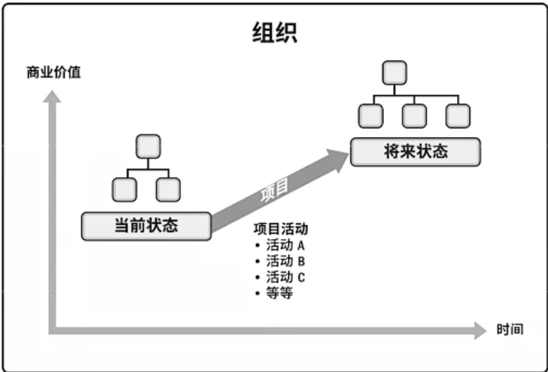

# 基础

PMP（Project Management Professional）。

PMBOK（Project Management Body of Knowledge）包活项目管理的十个知识领域和五个过程组，以及它们之间的相互关系和作用。

**项目管理业界定义的最重要价值观：责任、尊重、公正、诚实。**

## 引论

### 项目

**项目的定义**：是为创造**独特**的**产品、服务或成果**而进行的**临时性**工作。

**项目的特点：**

- **独特性**
- **临时型**
- **项目驱动变革**
- **项目创造商业价值**

**项目的独特性**

- 项目所创造的产品或服务，在一定的程度或在某些方面与其他的产品和服务相比较，有**明显的差别** （独特性会带来不确定性）

- 开展项目是为了通过可交付成果达成目标

- **可交付成果**：在某一过程、阶段或项目完成时，必须产出的**任何独特并可核实**的产品、成果或服务能力

  > 可核实即要求项目需验证产品，如软件测试等。

- 项目的可交付成果和活动中可能存在重复的元素，但这种重复并不会改变项目本质上的独特性

**项目的临时性**

- **项目有明确的起点和终点**

  > 项目终止的几种情况：
  >
  > - 达成项目目标
  > - 不会或不能达到目标
  > - 项目资金缺乏或没有可分配资金
  > - 项目需求不复存在（客户要求终止、组织管理层要求终止、战略或优先级变更致使终止）
  > - 无法获得所需人力或物力资源
  > - 法律或便利原因终止 

- 临时性并不一定意味着项目的持续时问短

- 虽然项目是临时性工作，但其可交付成果可能会在项目的终止后依然存在

**项目驱动变革**

从商业角度来看，项目旨在推动组织从一个状态（当前状态） 转到另一个状态 (将来状态），从而达成特定目标。

**项目创造商业价值**

项目的成果能够为相关方带来的效益，效益可以是有形的、无形的或两者兼有之。

- 有形效益：货币资产、股东权益、固定设施、工具、市场份额等

- 无形效益：商誉、品牌认知度、公共利益、战路一致性等

#### 项目管理

**项目管理：将知识、技能、工具与技术应用于项目活动，以满足项目的要求。**

- 项目是组织创造价值和效益的主要方式

- 为了在全球经济中保持竞争力，公司日益广泛利用项目管理，来持续创造商业价值

- <u>有效和高效的项目管理应被视为组织的战略能力</u>
- 有效的项目管理可以帮助：**管理制约因素** （例如范圍、质量、进度， 成本、资源）；**平衡制约因素对项目的影响**（例如范围扩大可能会增加成本或延长进度)

#### 项目集与项目组合

- **项目集**：是一组**相互关联且被协调管理**的“**项目、子项目集和项目集活动**“，以便**获得分别管理所无法获得的利益** （即1+1>2的效果）
- **项目组合**：是指为了**实现战略目标**而组合在一起管理的”**项目、项目集、子项目组合和运营工作**”，它们**不一定彼此依赖或者相关**

|          | 项目                                                      | 项目集                                                       | 项目组合                                                     |
| -------- | --------------------------------------------------------- | ------------------------------------------------------------ | ------------------------------------------------------------ |
| 包含     | 子项目、工作包、活动                                      | 子项目集、项目集活动、项目                                   | 子项目组合、运营工作、项目集、项目                           |
| 管理重点 | 以“正确”的方式开展项目 **项目本身的相互依赖关系**      | 以“正确”的方式开展项目集 **项目集组成部分之间的依赖关系** | 开展“正确”的项目集和项目 **资源分配的优先顺序、与组织战略协调一致**、共享资源 |
| 具体措施 | 通过制定和实施计划来完成既定的项目范围                    | 解决资源制约、处理变更管理、 管理风险、分配预算           | 指导组织的投资决策、选择项目集 与项目的最佳组合方式、提高实现预期 投资回报的可能性。 |
| 成功标准 | 以产品、项目的质量、 进度、 预算达成度、客户满意度衡量 | 以项目集向组织交付预期效益的 能力及交付效率和效果衡量     | 以项目组合的总体投资效果和实现的效益来衡量                   |
| 范围     | **有明确目标，范围渐进明细**                              | 范围更大，能提供更显著利益                                   | 因组织战略目标的变化而变化                                   |

**项目集之间的关键是协调；项目组合之间更多是资源的竞争，关键是优先级。**

> 示例：
>
> 

## 十大知识领域与过程组

**知识领域**

1. **项目整合管理**：包括**项目启动、规划、执行、监控和收尾等**整个项目管理过程中的综合管理
2. **项目范围管理**：需求收集、需求定义、范围规划、范围确认和范围控制等
3. **项目时间管理**：活动定义、活动排列、网络图、进度估算、进度控制等
4. **项目成本管理**：成本估算、成本预算、成本控制等
5. **项目质量管理**：质量计划、质量保证、质量控制等
6. **项目资源管理**：人力资源、物质资源、设备资源、资源计划和资源控制等
7. **项目沟通管理**：沟通计划、沟通管理和沟通监控等
8. **项目风险管理**：风险管理计划、风险识别、风险分析、风险应对和风险监控等
9. **项目采购管理**：采购规划、采购实施、采购控制和采购关闭等
10. **项目干系人管理**：干系人识别、干系人分析、干系人管理和干系人监控等

| 知识领域 | 启动         | 规划                                                         | 执行                               | 监控                              | 收尾           |
| -------- | ------------ | ------------------------------------------------------------ | ---------------------------------- | --------------------------------- | -------------- |
| 整合     | 制定项目规章 | 制定项目管理计划                                             | 指导与管理项目工作 管理项目知识 | 监控项目工作 实施整体变更控制 | 结束项目或阶段 |
| 范围     |              | 规划范围管理                                                 |                                    | 确认范围、控制范围                |                |
| 进度     |              | 规划进度管理 定义活动、排列活动顺序、估算活动持 续时间、制定进度计划 |                                    | 控制进度                          |                |
| 成本     |              | 规划成本管理 估算成本、制定预算                          |                                    | 控制成本                          |                |
| 质量     |              | 规划质量管理                                                 | 管理质量                           | 控制质量                          |                |
| 资源     |              | 规划资源管理 估算活动资源                                | 获取资源、建设國队、 管理团队  | 控制资源                          |                |
| 沟通     |              | 枧划沟通管理                                                 | 管理沟通                           | 控制沟通                          |                |
| 风险     |              | 规划风险管理 识别风险、定性风险分析、定量风险分析         | 实施风险应对                       | 监督风险                          |                |
| 采购     |              | 规划采购管理                                                 | 实施采购                           | 控制采购                          |                |
| 相关方   | 识别相关方   | 规划相关方参与                                               | 管理相关方参与                     | 监督相关方参与                    |                |

**过程组**

过程组项目管理过程按照时间顺序的五个主要阶段：

1. **启动过程组**（Initiating Process Group）：确定项目的目标和需求，并获得相关方的批准

   > 需要进行项目章程的制定、干系人的识别、项目管理计划的编制等工作。

2. **规划过程组**（Planning Process Group）：制定详细的计划

   > 需要进行范围、时间、成本、质量、资源、风险、采购和沟通等方面的规划。

3. **执行过程组**（Executing Process Group）：将项目计划转化为实际的成果

   > 进行各种资源的协调和管理，以确保项目按照计划顺利进行。

4. **监控与控制过程组**（Monitoring and Controlling Process Group）：对项目执行过程进行监控和控制、以及调整

   > 对项目执行情况进行监视、风险进行分析和管理、质量进行控制、进度进行跟踪。

5. **结束过程组**（Closing Process Group）：在项目完成后进行的一系列工作

   > 对项目成果进行验收、对干系人进行交接和沟通、对资源进行清理等工作。

## 敏捷

PMBOK是以计划驱动项目，提前规划项目，缺点是较难应对变化。而敏捷是以价值驱动项目，小步快跑，分阶段一点点完成项目。

> 敏捷是基于PMBOK发展而来的，PMBOK中具体许多项目管理的必要领域与过程，这些都会被敏捷所使用。

**基本概念**：

- **用户故事**：用户故事是一个独立的、可以实现的、有业务价值的需求描述，是敏捷开发中的核心概念
- 迭代开发：迭代开发是将整个开发过程分成多个迭代，每个迭代都可以得到一个可运行的产品增量，以实现快速迭代、以用户需求为主导的开发方式
- 产品负责人：产品负责人负责确定产品的需求和优先级，是与开发团队紧密合作的关键人物
- **Scrum框架**：Scrum是一种敏捷的方法论，重视团队合作、强调迭代开发和周期性检视
- **CICD：持续集成和持续交付**

**敏捷工具**：

- JIRA：项目管理工具，支持团队协作、缺陷追踪、需求管理、任务管理等功能
- Trello：看板工具，帮助团队更好地进行协作和项目管理

### 敏捷宣言

**敏捷四个核心价值：**

- 个体和互动高于流程和工具
- 工作的软件高于详尽的文档
- 客户合作高于合同谈判
- 响应变化高于遵循计划

**敏捷12大原则**：

1. 最高目标是，通过尽早和持续地交付有价值的软件来满足客户
2. 欣然面对需求变化，即使到了开发的后期。敏捷过程利用变化来为客户创造竞争优势
3. 频繁交付可工作的软件，交付的间隔可从数周到数月，交付周期越短越好
4. 在整个项目开发期间，业务人员和开发人员必须天天都在一起工作
5. 围绕被激励起来的个体来构建项目。给他们提供所需的环境和支持，并且信任他们能够完成工作
6. 最有效的、最高效的沟通方法是面对面的交谈
7. 可工作的软件是首要的进度标准
8. 过程提倡可持续的开发速度。责任人、开发者和用户应该能够保持一个长期的、恒定的开发速度
9. 不断地关注优秀的技能和好的设计会增强敏捷能力
10. 简单（尽最大可能减少不必要的工作）是敏捷流程的根本
11. 最好的架构、需求和设计出自于自组织型的团队
12. 团队定期反思如何提升效率，并调节和调整自己的工作方式

### Scrum框架

Scrum是一种敏捷的方法论，Scrum框架包含了**角色、事件、工件和价值观**。

**角色**：

- Product Owner 产品负责人：负责确定产品需求，并协调开发团队和利益相关者之间的沟通
- Scrum Team ：由多个团队成员组成，包括开发人员、测试人员、需求分析师等。开发团队是一个自组织的团队，共同完成所有的开发任务
- Scrum Master：负责帮助团队使用Scrum框架，协调交付流程，并确保团队尽可能充分地利用Scrum框架

**事件**：

- Sprint 迭代：迭代是 Scrum 团队共同完成增量的实际时间段
- Sprint Planning 迭代计划：每个Sprint开始前，确定在本次Sprint中要完成的任务
- Daily Scrum 每日站会：每日15分钟的会议，用于协调团队成员的工作，及时解决团队成员遇到的问题
- Sprint Review 迭代评审：Sprint结束后，展示已经完成的任务，并让利益相关者提供反馈和建议
- Sprint Retrospective 迭代回顾：审查上一个Sprint的工作，总结经验教训，并确定下一个Sprint所要改进的地方

**工件**：

- Product Backlog 产品积压清单：这是一个列表，列出了所有的产品需求，并按照优先级进行排序，作为Scrum团队工作的主要参考
- Sprint Backlog 冲刺目标：每个Sprint的完成目标，由Scrum团队一起协商和确定
- Increment 增量产物：Sprint期间完成的所有任务都会贡献到最终的增量产物中，增量产物是一种可运行的、用户可用的软件产品

**价值观**：**承诺， 专注， 开放， 尊重，勇气**

> **Scurm规则**：
>
> - Sprints的时间长度是固定的：Sprint的长度通常为1~4周，Sprint的时间长度应该是固定的，并且是由团队一起协商和决定的
> - Scrum团队应该是自组织的：Scrum团队应该是自组织的，团队成员应该在整个开发过程中一起决策、协作、解决问题
> - 增量产物必须是可用的：在每个Sprint结束时，增量产物必须是可用的、可演示的，并且需要符合产品负责人所定义的定义“完成”的标准
> - 反馈机制：Scrum框架中有多个反馈机制，如每日站会、Sprint评审会等，这些反馈机制为团队和利益相关者提供透明的沟通渠道
> - 每个Scrum团队只有一个产品负责人
> - Scrum团队成员应该具有跨职能性：Scrum团队中的每个成员都应该具备跨职能性，能够完成不同领域的工作，并协助其他团队成员
> - 经常检视和适应：Scrum框架中最核心的思想就是经常检视和适应。通过每个Sprint结束后的回顾会议，团队可以对自己的工作进行自我评估，并提出改进措施，不断改进整个开发过程

