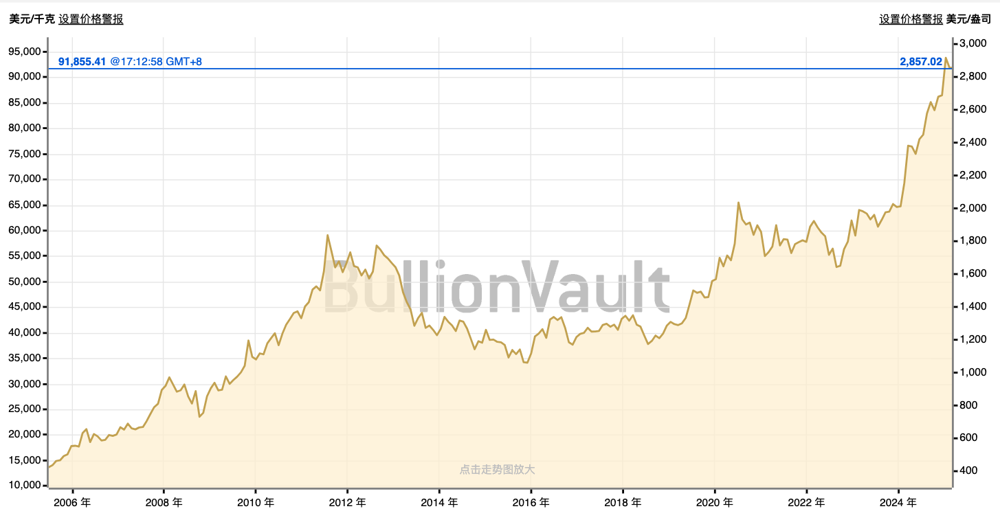
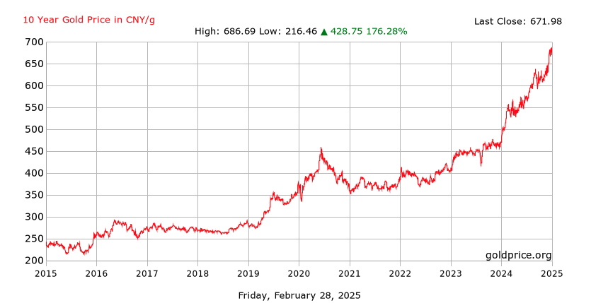

# 走资

日益增长的境外投资需求和外汇管制之间的矛盾

走资人士必备的三种账户：

- 私密储蓄账户：主要用于储蓄，大部分闲置资金存在里面，有高度的安全性和私密性
- 日常支出账户：主要用于你的日常消费支出
- 资金中转账户：主要用于接收高风险资金（例如：币圈C2C/交易所资金），然后再转到自己的其他账户

**私密储蓄账户推荐**

普通人： 

- 香港汇丰银行One账户：去香港柜台办理
- 香港招商永隆/工银/中信：先预约，再去香港柜台核实身份
- 新加坡华侨银行：全程线上开户，有视频教程
- 南洋商业银行：去香港柜台办理

有条件的：

- 美国 / 新加坡汇丰
- 新加坡DBS
- 香港渣打银行/花旗银行

**日常支出账户推荐**

- 手续费少的借记卡
  - 内地：汇丰万事达
  - 香港：Za Card
  

**资金中转账户推荐**

- 首选（银行/券商）：XAPO/瑞讯银行/iFAST /嘉信理财
  - 虚拟银行：香港理慧银行/众安银行

- 次选（电子货币机构）：Wise / ZEN / Quppy / Advcash /Biyapay / 炼金支付

## 汇出

如果金额在300万以下，首选**熊猫速汇**，简单方便。

> 熊猫---OCBC，熊猫----汇丰，熊猫---嘉信理财，熊猫---世界各地

熊猫速汇并不占用购汇额度，但是当你的汇款总额达到30万，审核部门有可能需要提交额外的材料（比如签证），如果你无法提

供，那就不能继续汇了。但是你可以借用他人的额度。

### 投资

**低风险投资**

主要目的是保值，以应对货币贬值或通货膨胀。

- 在嘉信理财购买美国国债

- 盈透闲置资金：闲置资金自动产生收益，最高4.83%的美元利息

- 银行定存

  > 境外银行的定存利率普遍不高

- 外币保值

**高风险投资**

- 炒股
- 炒虚拟币
- 炒外汇

# 黄金

境外黄金价格走势：

境内黄金价格走势：

**1盎司（oz）等于约31.1035克（g）**。

## 购买渠道

### 境内

**(1) 银行**

- **推荐理由**：银行是购买金条的主要渠道之一，金条质量有保障，且支持回购。
- **购买方式**：
  - 直接到银行柜台购买。
  - 通过银行的手机App或网上银行购买（部分银行支持）。
- **注意事项**：
  - 银行出售的金条通常为投资金条，纯度较高（如Au9999）。
  - 购买时需携带身份证，部分银行可能需要开通贵金属账户。
  - 了解银行是否提供回购服务及回购条件。

**(2) 上海黄金交易所**

- **推荐理由**：上海黄金交易所是国内最权威的黄金交易平台，适合大额投资。
- **购买方式**：
  - 通过会员单位（如银行、证券公司）开户并交易。
  - 个人投资者需开通黄金交易账户。
- **注意事项**：
  - 交易门槛较高，适合专业投资者。
  - 需支付手续费和仓储费。

**(3) 金店**

- **推荐理由**：金店（如周大福、老凤祥）不仅销售金饰，也出售金条。
- **购买方式**：
  - 直接到金店柜台购买。
- **注意事项**：
  - 金店的金条可能包含较高的工艺费，价格比银行略高。
  - 购买时需索要发票和鉴定证书。

### 境外

**购买方式**：通常可以通过开设海外银行账户或直接到银行柜台购买。

**(1) 开设海外银行账户**

- **选择银行**：选择支持黄金交易的海外银行，如瑞士银行（UBS）、汇丰银行（HSBC）、新加坡星展银行（DBS）等。

**(2) 购买黄金**

- **购买方式**：
  - **实物黄金**：直接购买金条或金币，银行会提供鉴定证书和保险服务。
  - **纸黄金**：通过银行账户购买黄金衍生品（如黄金ETF、黄金期货），无需持有实物。
- **支付方式**：通常可以使用银行账户余额、信用卡或国际汇款。

**(3) 提取或存储**

- **提取实物黄金**：如果需要提取实物黄金，需支付额外的运输和保险费用。
- **银行存储**：大多数海外银行提供黄金存储服务，但会收取一定的保管费。

**推荐国家和地区**

- **瑞士**：以安全性和隐私性著称，瑞士银行提供优质的黄金存储服务。
- **新加坡**：金融体系发达，税收政策优惠，适合亚洲投资者。
- **香港**：作为国际金融中心，香港银行提供多种黄金投资产品，且与中国大陆联系紧密。
- **美国**：适合购买黄金衍生品（如黄金ETF），但需注意税务问题。

### 购买金条的注意事项

- **金条纯度**

  - 投资金条的纯度通常为Au9999（含金量99.99%）或Au999（含金量99.9%）。

  - 购买时需查看金条上的标识和鉴定证书。

- **价格**

  - 金条价格通常由两部分组成：基础金价（根据国际金价浮动）和加工费。

  - 不同渠道的加工费不同，银行通常较低，金店较高。

- **回购政策**

  - 购买前需了解渠道的回购政策，包括回购价格、手续费、是否需要保留原包装等。

  - 银行和金店的回购政策可能不同，需提前确认。
