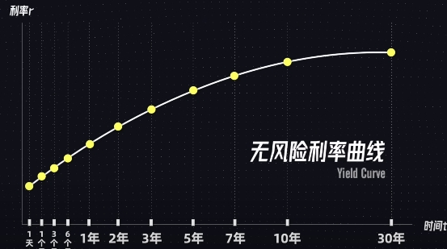
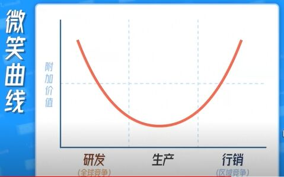
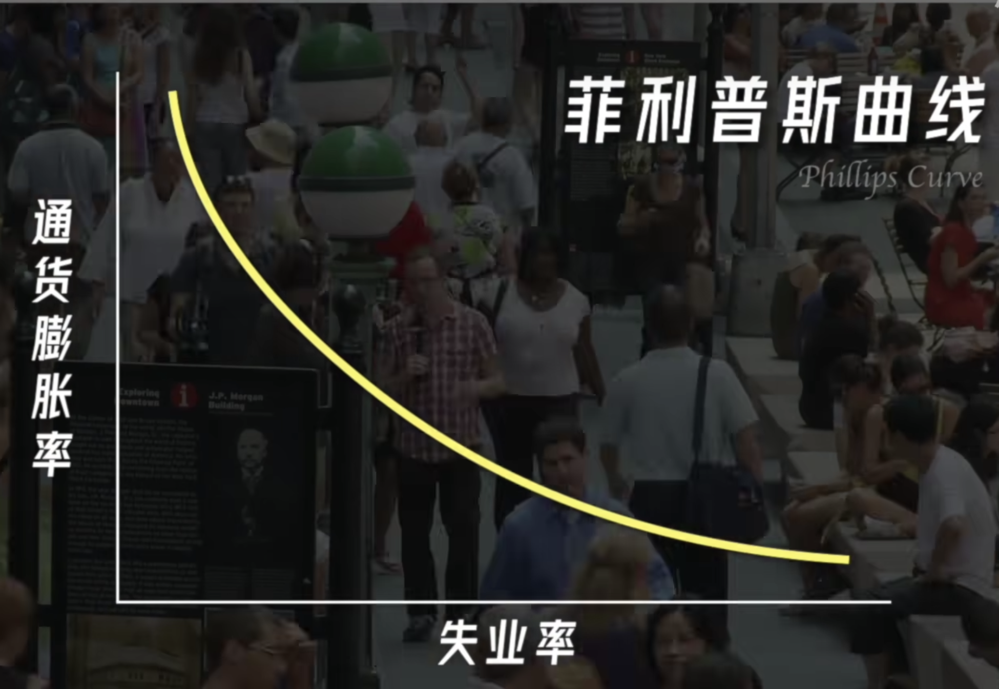
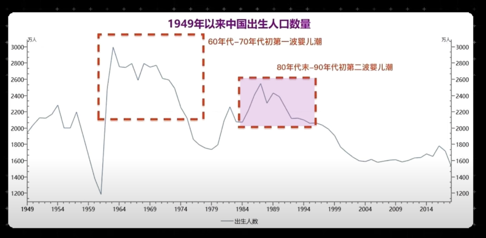
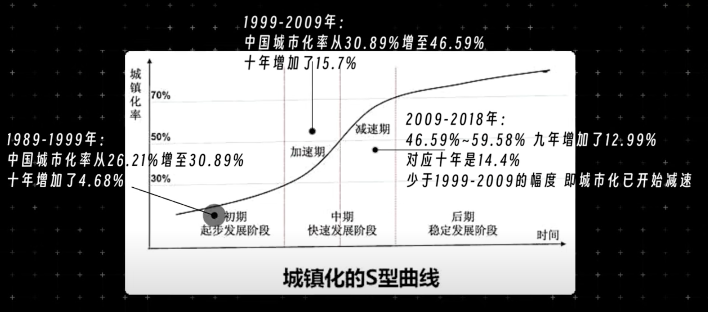
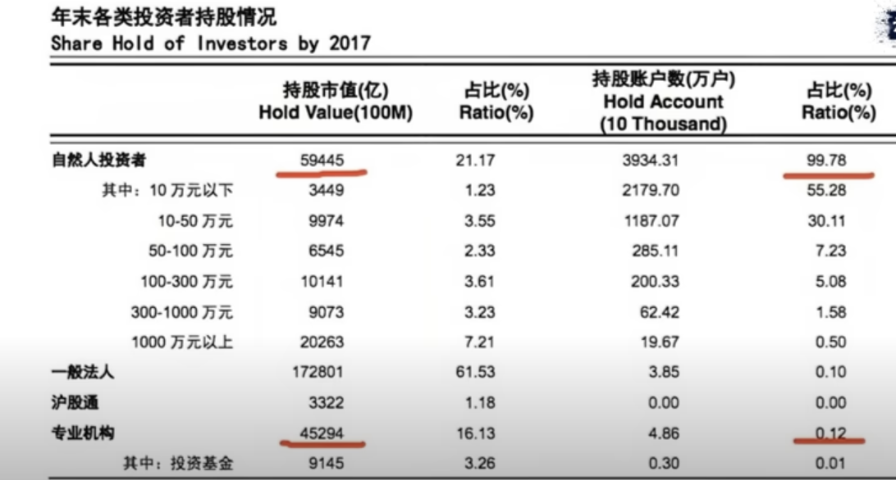
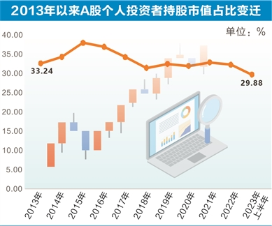
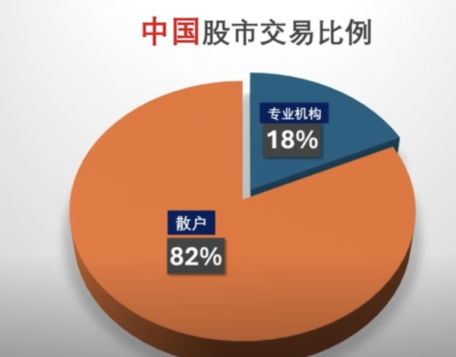

#  名词解释

## GDP

GDP（国内生产总值）可以被看作是一国所有最终产品和服务的价值总和。而这个价值是由投资、消费和净出口（出口减去进口）三个主要因素决定的。

具体来说，GDP可以表示为：GDP = C + I + G + (X - M)

其中，**C表示消费支出，I表示投资支出，G表示政府支出，X表示出口，M表示进口**。

## PPI/CPI/NFP

## 一级市场/二级市场

**一级市场**

一级市场，也称为发行市场，是指金融资产首次在市场上进行发行和交易的市场，**金融资产的发行者（如公司、政府债券等）向公众或特定投资者出售金融资产，以筹集资金**。

**一级市场通常由证券承销商或发行人直接进行交易，而非投资者之间进行交易**。一级市场中的交易包括股票首次公开发行(IPO)、债券首次发行等等。

在一级市场中，发行人需要依据证券法规制定相关的发行文件，包括招股书、发行公告等，并注册在相关证监会进行审核并获得批准后才能进行交易。同时，一级市场中的投资者通常是潜在的长期投资者，如基金公司、养老保险公司、大型机构投资者等。

**二级市场**

二级市场指的是已经发行的金融资产（如股票、债券、衍生品等）在**投资者之间进行自由买卖**的市场。

在二级市场中，投资者可以通过买入或卖出已经存在于市场上的金融资产来实现交易。这意味着二级市场提供了流动性和价格发现的机制，让投资者能够随时买卖资产，并根据市场供求关系决定其价格。

**常见的二级市场包括证券交易所（如股票交易所）、债券市场、期货交易所和外汇市场等**。

**MBS市场**

MBS市场通常被认为是二级市场，指的是**抵押贷款支持证券**（Mortgage-Backed Securities Market）的交易市场。**抵押贷款支持证券是一种金融工具，通过将大量的住房抵押贷款打包成证券化产品**，并进行买卖交易，从而转让了原始抵押贷款的风险和收益。

> MBS市场的运作方式如下：
>
> 1. 首先，借款人向银行或其他金融机构申请住房贷款，这些贷款会被打包成一个抵押贷款池
> 2. 发行人会将该抵押贷款池中的贷款转化为抵押贷款支持证券，分为不同的等级和利率类别。这些证券会在MBS市场上进行公开发行，并由投资者购买
> 3. 投资者购买这些抵押贷款支持证券后，就可以享受到这些证券所对应的现金流，通常是贷款本金和利息的支付

## 量化宽松/缩表

**量化宽松**（Quantitative Easing，简称QE）旨在**增加货币供应量**、促进经济增长并防止通货紧缩。它的实施方式是央行通过购买大量固定收益证券等资产来增加市场上的流动性，从而使市场上的资金供应增加，刺激投资和消费，从而**引导利率下降**。

> 08年后美联储发现只控制 Fed Funds Rate 不够，有时就自己印钱，到市场上参加公开市场操作。比如10年期国债利率太高，就大量购买10年期国债；30年期国债利率太高，就大量购买30年期国债；贷款利率太高则大量购买MBS。当央行购买大量长期国债时，需求上升导致债券的价格上升，从而使债卷的长期利率下降。这种操作，即是“**量化宽松**”。

**缩表**是指**央行出售手中持有的资产，从而减少其在市场上的资金供应量，以达到紧缩货币供应、控制通货膨胀的目的**。这通常是通过央行出售国债、货币市场工具、质押证券等金融资产来实现的。

## ETF

Exchange Traded Fund（交易所交易基金）。

> 例子：SPY（SPDR S&P 500 ETF）, IVV（ishares core S&P 500 ETF）。

## P/E Ratio市盈率

## 资产负债表/成本收益表/现金流量表

 

## LPR

##  PMI

## P/E , PEG

## 萨姆规则

## 基础货币 / 流通货币

货币乘数：货币乘数也称之为货币扩张系数或货币扩张乘数是指在基础货币（高能货币）基础上货币供给量通过商业银行的创造存款货币功能产生派生存款的作用产生的信用扩张倍数，是货币供给扩张的倍数。在实际经济生活中，银行提供的货币和贷款会通过数次存款、贷款等活动产生出数倍于它的存款，即通常所说的派生存款。货币乘数的大小决定了货币供给扩张能力的大小。

央行的钱，通过银行银行体系放出，货币乘数最多就是7倍。通过股市放出，至少10倍。

# 利率

**降息（利率低）**

- 短期内：促进消费、投资，促进经济增长
- 长期内：导致通货膨胀

**加息（利率高）**

- 短期内：钱流动越少，抑制经济增长
- 长期内：抑制通货膨胀

 

**贷款的利率组成：贷款银行的自定利率 +风险溢价（针对贷款人进行评估） + 无风险利率。**

> 如个人贷款5%的利率：约0.2%的银行自定率用 + 1.8%的风险溢价 + 3%的无风险利率。

## 债卷利率

**对于一个债卷，债券的收益率（利率）和价格之间存在反向关系，这是由于债券的固定收益特性所决定的。**

> <u>债券的固定收益特性是指债券在发行时确定的利率</u>。当企业或其他机构发行债券时，它会向债券持有人承诺以固定的利率支付利息，通常是按照票面利率计算。例，一张债券的面值为1000元，票面利率为5%，那么该债券每年将支付50元的利息给债券持有人。
>
> 债券的利率（yield）是指持有债券期间所能获得的预期收益率，可理解为债券的年化收益率。
>
> 债券的价格是二级市场上交易的价格。

**当债券的市场价格上升时，债券的固定收益不变，债券的利率就下降了**。即：债券价格上升导致其收益率下降。

反之，如果**债券的市场价格下降，债券的固定收益不变，债券的收益率就会上升**。因此，债券价格下降导致其收益率上升。

**对于相同期限的不同债卷，新发债卷的发行利率，会影响已有的债卷在二手市场上的价格。**

当新发债卷的发行利率更高，已有的相对低息的债卷需求会减少，从而低息债卷价格下降，高息债卷价格上升。反之。

**对于不同期限的不同债卷，中长期债卷的利率会受短期债卷，以及对未来的预估的影响。**

> 以23年美联储为例，由于短期债卷的利率上涨，同时外界预估未来几年美联储会继续保持高息，因此抛售手中的低息中期债卷，从而导致中期债卷的利率上升。

## 无风险利率

无风险利率，表示肯定具有还款能力的借款者，其贷款所需要的利率。

<u>比较大的经济体的政府，可以被近似认为无风险的</u>。这些**政府发行的债卷，如中国国债、美国国债，所对应的利率，则可认为对应货币的无风险利率。**

债券是可以通过二级市场自由交易的，债卷价格是由市场决定的，因此**债券的利率最终由市场控制**。

**每一个货币的每一个期限，都对应着一个无风险利率。**

> 如美国国债的10年期利率为2.84%，30年期利率为3.30%。

**无风险利率曲线代表着一个经济体的核心利率，是一个经济体的基准。**通常来说，长期利率是高于短期利率的。

> 当一个经济体中的中长期利率低于短期利率时，这种情况称为“利率倒挂”。

**无风险利率，实际由对应政府的央行控制。央行通常控制最短期利率/比较短期的利率，从而影响二级市场（国债市场、MBS市场）中的债卷价格，从而进行经济宏观调控**。

美联储/欧洲央行，控制的都是隔夜拆借利率，即一天的利率。**对于银行来说，隔夜拆借利率是最关键的**。而我们常说的美国加息中的利率，即是隔夜拆借利率（Fed Funds Rate）。

> 央行是无法通过长期债卷的发行利率，直接控制长期债卷利率。因为周期太长，长期利率完全由市场供需决定，需要基于市场调控。
>
> 而隔夜拆借利率，央行相当于每天都是发行全新的债卷并全量回收，因此对发行利率加/降息，会直接影响市场上的利率。

**央行的加息/降低，对长期利率影响不大，而量化宽松和缩表对长期利率影响大。**

## 对股票的影响

**加息对股票理论影响： **

- **融资角度：公司融资成本增加（Both 贷款/发债） -> 公司发展受阻 -> 利空股票**

  **加息对重融资的行业负面影响更大。**

  > 假如一个公司的资产负债表中，很大一部分是短期债，则加息的负面影响是很大的。

- **消费者角度：消费者融资成本增加 -> 公司收益下降 -> 利空股票**

  对依赖消费者贷款的行业负面影响更大。

  > 如房地产行业、车企等需要房贷、车贷的。

- **市值估价角度**：一个公司当前的股价，应该等于该公司未来的所有现金流折现到当前。而折现率与利率正相关（利率高理论会降低公司的现金流），折现率变高即未来的钱折现到当前的钱会更少。即**加息利空股票**。

  > 此角度实际影响很小。

- **流动性角度：流动性匮乏 -> 股市资金量下降 -> 利空股票**

  > 最直接最大的影响角度。

但经济学是多维度的，错综复杂，需要从多个角度考虑股票的涨跌。

> **如：加息是为了抑制通胀，而通胀环境下，买房需求旺盛，会利多房企股票，与上面的利空股票是相互冲击的。**

**总体而言，利率对股市的影响并不直接，但量化宽松对股市的利多是立竿见影的。**

# 股票投资

股票投资分析分为：**技术分析，基本面分析**。

**投票价值短期看供需，长期看价值。**技术分析通常用于量化型对冲基金或交易公司的短期投资，个人投资者没有足够的资源应用技术分析，通常使用基本面分析。

## 技术分析

根据股票历史数据（价格、成交量、波动率等），套入数学模型进行未来的预测。常见基础数据模型：双肩、放量、仙人指路、量涨价涨。

目前的交易公司，会实时收集政策、新闻导入分析模型中，利用计算机技术优化模型。

## 基本面分析

基本面分析分为三个层次：**宏观、行业、选股**。

### 宏观

各中宏观的经济调整，本质都是在调整经济体中的货币量。

> 美国12年牛市的宏观层次原因：量化宽松/零利率、税收减免、其它地区疲软。
>
> 中国17年熊市：17年中国去杠杆，整体资金量减少，导致多个企业暴雷

**市场中平均的PE特别高，基本上反映当前股市整体价格偏高。即未来可能总体市场股价下降。**

**宏观层面主要影响投资人投资哪个经济体**，如A股、港股、美股、创业板，国家基金等。

### 行业

行业对股票投资的影响是最重要的。

行业层次的分析可分为：

- **行业所处周期**：夕阳行业/朝阳行业

- **行业格局**：行业门槛有多高

  > 行业门槛越高，通常利润空间越大。

- **政府政策**

- **板块轮动**

  > 即大众在一段时间内，偏好买某类型的股份，如成长型股票、科技股、概念股等。

**行研报告**

行研报告产方：券商、咨询公司、数据库（万德、Bloomberg）。

行研报告中，最精细的产自券商的研究部门（Equity Research）。

**看好某行业，可选择购买对应行业的ETF，可无需购买具体公司的股票。**

### 选股

**股票价格，理论上等于市场预期未来总股利（现金流）的折现。**

公司分析分为定性分析、定量分析：

- **定性分析：公司的模式、成长、护城河、增长点、利润空间**

  - 利润空间：考察公司的利润空间，需要考察公司在产业链中属于什么角色

    > 对于线性产业，通常符合微笑曲线。研发端（专利/技术）和行销端（品牌/服务）的利润空间更大，而生产（组装/制作）由于门槛更低，利润空间更小。
    >
    > 

  - 护城河：种类包括：研发、品牌、用户、资金

    > 如亚马逊利用资金的护城河，可对某些垂直领域电商打价格战。

- **定量分析：资产负责表、成本收益表、现金流量表、市盈率、利润率**

  - 市盈率：不同行业的市盈率差距很大，但同一行业的类似运营模式的公司，可进行市盈率对比

    > 如科技行业的公司很多都不盈利，导致市盈率特别高。

  - 利润率：利润率=利润/收益

    > 传统行业的利润率平均处于20% ～ 30%，轻资产行业的利润率平均为33%

  - 具体行业具体指标

    > 零售行业：现金流、房地产：资产、医院：EV（企业价值）/病床数。

  - 管理层

  

**注意点**

- 好公司 != 好股票。对于顶级公司而言，股价可能已经处于高位
- 对于已在市场上广泛流通的信息，八成已经被 Priced in，已考虑在目前的股价中了

# 经济金融岗位

**金融类**

- 买方卖方/一级二级

  - 卖方：投行/券商

    > 投行部职能：帮助目标公司融资（发股、发债），收购其他公司；交易销售部：销售各种金融产品（股票、债卷、货币、大众商品）。 

  - 买方： 资产管理公司、公募基金、私募基金、对冲基金

    > 投资者关系维护；投资研究/交易/风险管理。

  - 量化：同时存在于买方/卖方，即金融区中的程序员

    > 通过编程解决定价、策略产生。

- 银行

  - 商业银行

    > 对个人/公司的信贷业务；财富管理/私人银行。
    
  - 政策性银行：基于国家政策扶持相关的项目
  
    > 国内三大政策性银行：国家开发银行、进出口银行、农业发展银行。

- 保险类

  - 保险销售
  - 保险资管：投资研究/交易

- Fintech金融科技：金融类软件

  > App:  支付宝/Paypel， 数据库： Bloomberg、万德。

- 财务/会计

  >  如上市等需要向大众公开财报，需要请求会记事务所（四大）来审计。

# 通货膨胀/紧缩

## 定义与影响

通货膨胀本质原因：经济体中流通的货币量，超过了经济的体量；过多的货币追逐过少的商品。

**对于经济体而言，最终追求的是更高的产值，即实际GDP。** 

通货膨胀本质上无时无刻不在进行的财富的再分配。**适量的通货膨胀，让现货币的购买力实时微度减少，从而促进实时的消费/投资，增加社会总需求，最终促成GDP增长。**

> 各个经济体常规通过膨胀目标：2-3%

- 通货紧缩：让现货币的购买力实时增加，从而减少实时的消费/投资，减少社会总需求，导致GDP增加缓慢/停滞/倒退。
- 超高速通货澎涨（HyperInflation）：现货币的购买力快速减少，导致赚钱/存钱再无意义，投资生产大幅减少，金融体系崩溃，失业人数骤增。 历史上经历 HyperInflation 的国家几乎无一例外全都要经过艰苦草绝的全面重启，改革。

## 通货膨胀与股市

 IMF（国际货币基金组织）对71个经济体的观察，不管是发达国家/发展中国家，**股价的表现和通货膨胀是负相关。**即高通胀时，股票一般都会跌。

**促使股票下跌最主要的原因是政策**。在高通胀时期，不管是财政政策还是货币政策，政府和央行为了抑制高通胀，一般都会采取紧缩的政策，从而导致股价下跌。

> 特例行业：在高通胀时期，能源公司的股票通常表现的很好。

##  原因

**导致通胀可能的因素**

- **需求拉动（Demand Pull ）**

  - 总需求增加 -> 产量增加，物价上涨 -> 企业收入上涨 -> 再次促进总需求增加

  - 政府很多情况下刺激经济就会从刺激总需求入手，但需求拉动的也同时带来物价上涨，通货膨胀 

  - > - 由科技创新/商业模式，如市场新增新的消费商品，如奶茶/AI等，拉动人们对此类商品的需求，最终带动总需求增加。
    > - 政府发放补贴：基建项目、项目补贴，直接发钱到个人

  - 需求拉动的最高结果：拉动经济同时带来尽量少的通货膨胀。当产能/产量已饱和时，需求拉动几乎不增长产量，仅带来通货膨胀；而当产能/产量有巨大缺口时，就能在提高产量同时尽量少的通货膨胀

    > 如何判断产能尚有提升潜力：失业率。失业率低（2%-3%），表明社会产能已到上限。
    >
    > 

- **成本推动（Cost-Push）**
  - 成本上涨 -> 价格上涨 -> 减少社会总需求 -> 减少产量
  - 属于供给推动通货膨胀。此类型通货膨胀不仅带来通货膨胀 ，同时打击经济
  - 成本来自原材料价格（石油、矿物 ）、汇率骤减（汇率骤减导致本国进口商品价格飙升，导致成本飙升）
- **货币供给（Money Supply）**
  - 政府过度货币供给，同时会推动需求拉动的通货膨胀，和成本推动的通货膨胀，最终带来无法刹车的恶性通胀。恶性通胀无一例外都存在政府无节制印钱
- 市场信心与货币流通量
  - 由于市场对未来的预期为通货膨胀，因此大家加大开销。即使在货币总量不变的情况下，货币的流通速度增加，即增加了货币流通量，从而带来通货膨胀

# 人口结构

# 股票

- 专业机构：专业机构是指专门进行证券投资的法人机构。投资相对稳定。
  - 主力：指某只或某几只中影响里很大的持股机构。一个股票只有一个庄家，主力可以有多个。
- 散户：换手率高，跟风化，追高杀低。

A股投资者结构：

一、境内机构，包括“国家队”资金（社保、养老、企业年金、证金、汇金）、公募基金及非公募类专业机构（券商、券商集合理财、信托、保险、银行、私募等）；二、产业资本（非金融类上市公司、财务公司、一般法人）；三、个人大股东（剔除“国家队”、机构、外资、产业资本以外的前十大股东）；四、外资（北上资金、合格境外机构投资者QFII）；五、个人投资者。其中公募基金在半年报、年报中披露完整持股，其余机构、产业资本均为前十大股东数据，外资数据来源于央行披露的完整数据。

产业资本持股比例依然最高，达到43.24%，虽然较2013年下降了近2个百分点，但从历史数据看，产业资本的持股始终保持40%以上

A股中，散户的交易比例占总量80%，机构占20%。但散户的持股量仅30%（2024年，从2007年60%下降至此）。由于金融环境的不透明，如大量上市公司的财报造假，至2024年，A股的拉升，底点，顶点全部由主力决定，散户长期被割。

> 2024年09的刺激政策，可能会标志是标记国家队与产业资本的决裂，产业资本可能被国家队标记为阻碍中国经济复苏的反贼。国家队可能希望A股的不再由主力决定，而是增加散户资金的进行，最终向美股看齐。但是，这需要全面、涉及底层的改革，营造一个透明公开的金融环境，这非常困难。

美股中，散户的交易比例 占总量20%，机构占80 %。大部分的投资人，均将股票交给专业机构进行代理，并非进行直接的投资。由于金融环境的成熟，散户的参与度低，美股的拉升、底点、顶点是由资金的合力决定的，并非由主力决定。

# 货币

https://www.youtube.com/watch?v=D-bYcvRknGM