场？Alpha？时间重映射？

# 合成

## 基础操作说明

**新建合成： **

1. 直接新建合成：可设置分辨率，帧率，时长，合成背景色。

   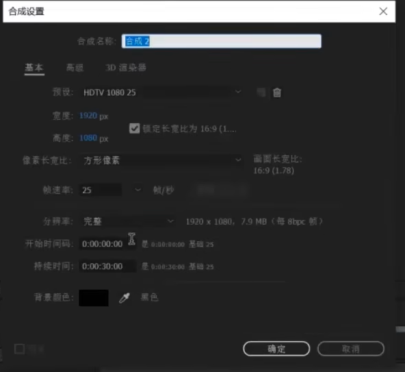

2. 按素材新建合成：素材拖动到合成图标，可以按素材的分辨率，帧率，时长，合成背景色进行合成

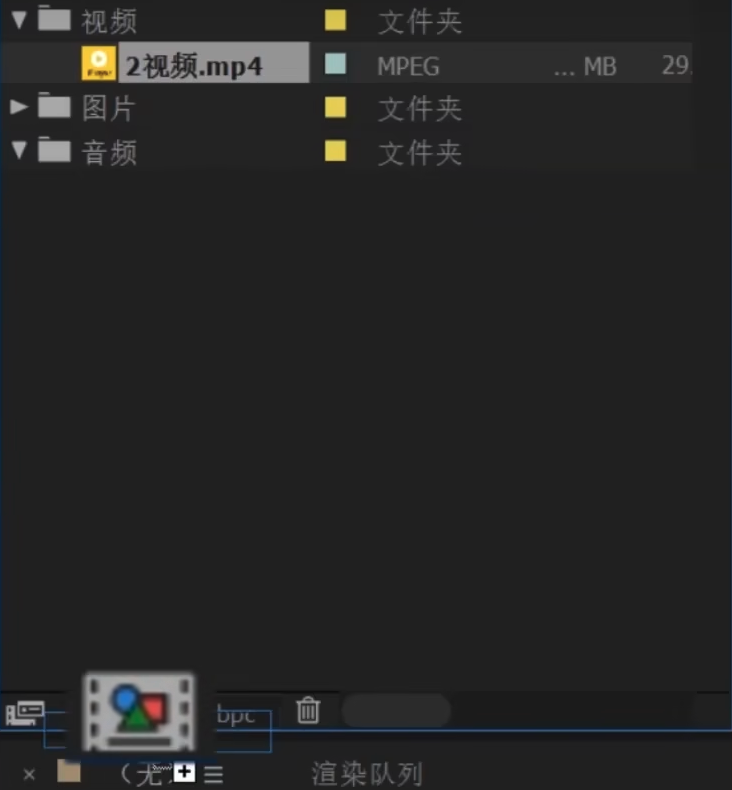

**限制合成中素材的时长：**

1. 点击素材中的预览
2. 定义入点、出点
3. 拖入合成

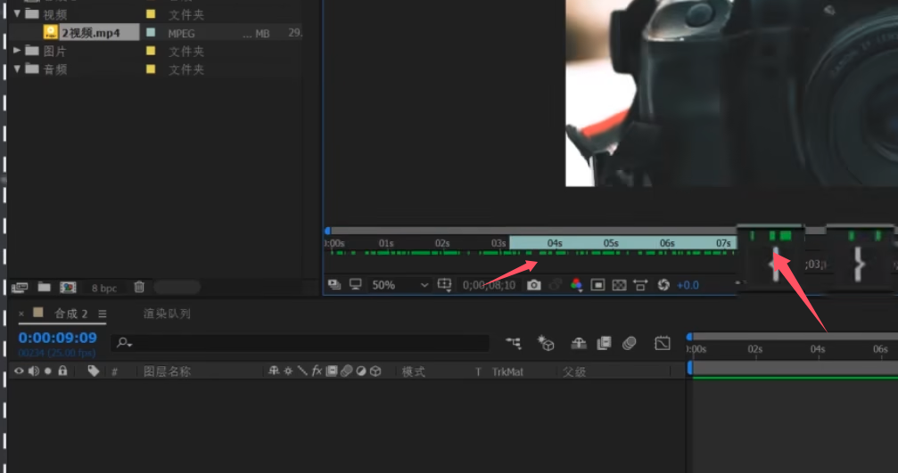

**裁剪素材大小：**

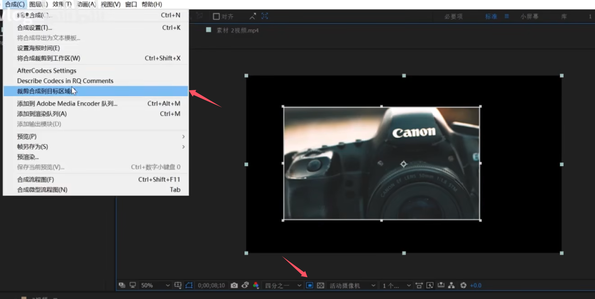

**预合成**：对多个图层进行预合成，即PS中图层组。

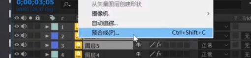

### **合成界面**

从左到右，分别为画面隐藏，声音隐藏，独奏，锁定。

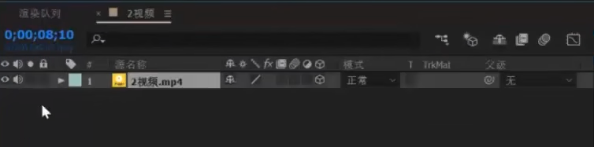

- 消隐：为当前图层标记为消隐。配合总按键使用，统一对标记“消隐”的图层进行显示，隐藏

  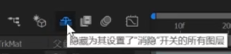

- 小太阳：可以读取图层中的矢量信心，是矢量图层可以无限放大并始终保持清晰

- 斜线：设置图层显示的质量，往上走的质量较好

- fx：显示/隐藏图层上的添加的所有效果

- 帧混合：配合总开关使用。可提高图层的帧率

  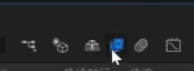

- 动态模糊：配合总开关使用。当图层有位移时，可加上动态模糊。

  - 模糊程度可以在合成设置的高级中通过改变快门角度调节

  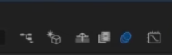

- 调整图层：将当前图片设置为调整图层（类似特效图层），使其对该调整层以下的层生效

  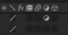

- 三维图层：当前图层变为三维图层，使其受摄像机和灯光的影响

- 轨道蒙版：

  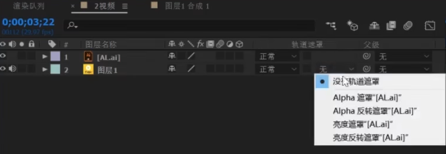

  - 一般是选择上一图层的“Alpha遮罩”，“亮度遮罩”，作为当前图层的蒙版，达到当前层尽显示部分的效果。每两层实现一个蒙版效果

  - Alpah遮罩：

    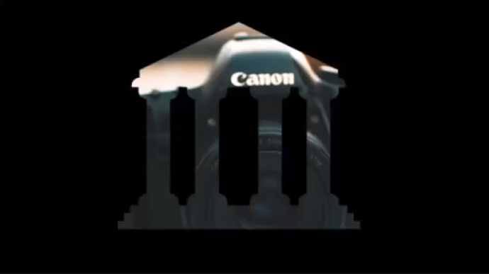

  - 亮度遮罩：

    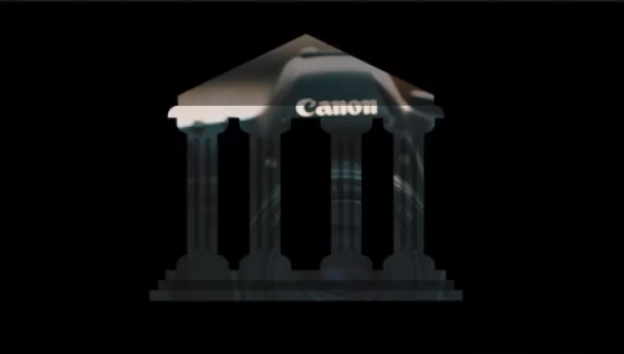

- 父级：指定父级后，当前图层的位置信息，就由全局坐标变为局部坐标，局部坐标的原点就在父级的锚点上

- 入点，出点，持续时间，速率

  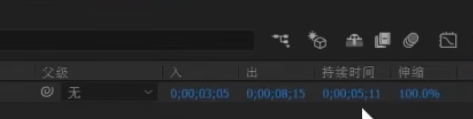

- 合成微型流程图：查看当前合成的父子合成

  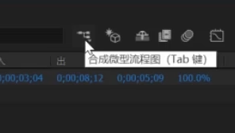

  - AE中，各个合成为父子树结构，仅有一个根节点。

- 动画图标编辑器：在细调关键帧使用

  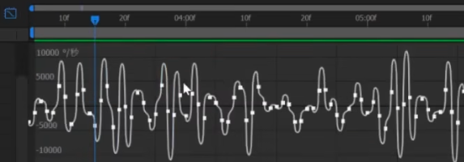

### 图层操作

**图层样式**：效果与PS类似

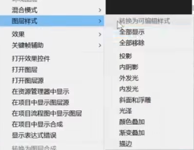

**图层-变换**

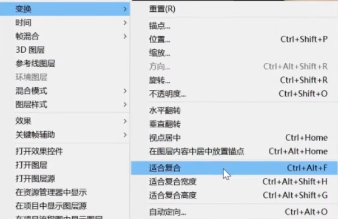

**图层-时间**

- 冻结帧：当前图层的所有帧都变为当前所选帧

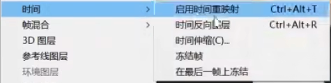

**序列图层**

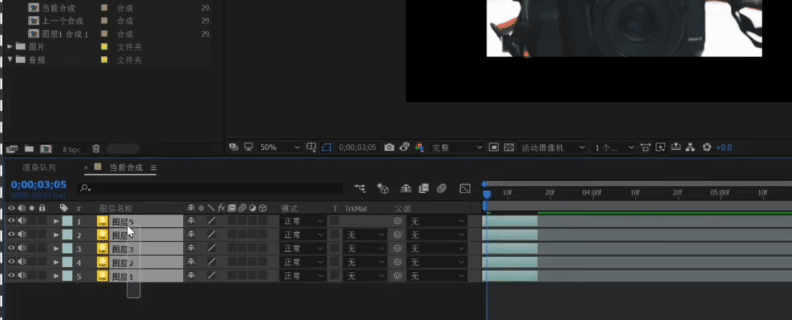

**跟踪**

AE的跟踪分为点跟踪，面跟踪，三维摄像机反求等等。

作用：求得某个物体的运动数据后，从而对物体进行二次修改，后加入追踪物体。

### 图层属性

**变形**

  

**关键帧**：按“U”可以显示该图层的所有关键帧

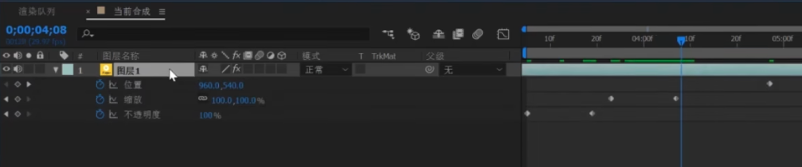

**效果**

- 效果可以在效果控件上查看，也可以在图层的属性中查看
- 作用：各个中高级效果，如扣绿幕

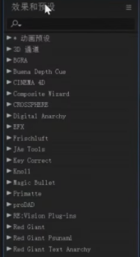

**图层动画**

- 图层的每个属性都可以添加动画，可以通过关键帧和表达式来实现

- 点击属性前的“码表”，进入动画编辑-关键帧

  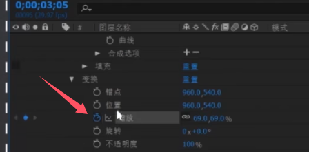

- 点击属性前的“码表”+Alt，进入动画编辑-表达式

  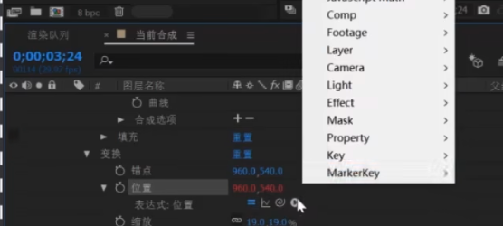

  - 表达式可以实现多种工作量高的功能：如抖动， 循环位移，旋转。
  - 表达式完成后可以转换为关键帧，进一步调整

**蒙版**

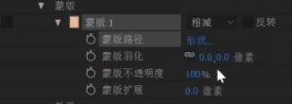

- 蒙版模式：相加，相减
- 蒙版羽化

### 工具

**形状工具**

-   在选择图层时，给图层添加蒙版

  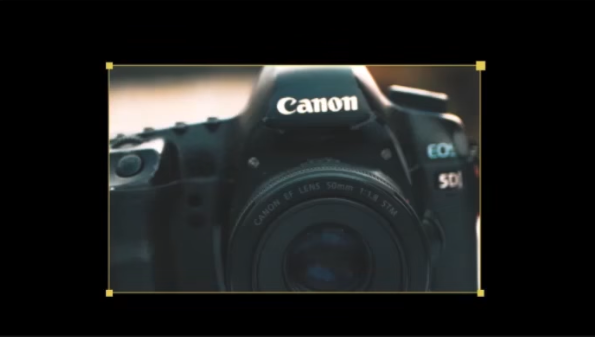    

- 在不选择图层时，会新建一个形状图层

  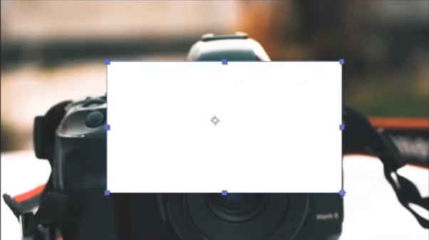

**钢笔工具**

- 与形状工具类似，选择图层得到蒙版；不选择图层得到形状图层

**Roto笔刷**

- 用于抠像，常用做复杂背景视频的抠像

  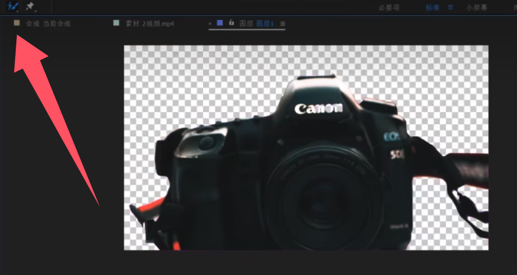

**图钉工具**

- 可对图层进行打点，自由变形。可用在mg动画制作中

  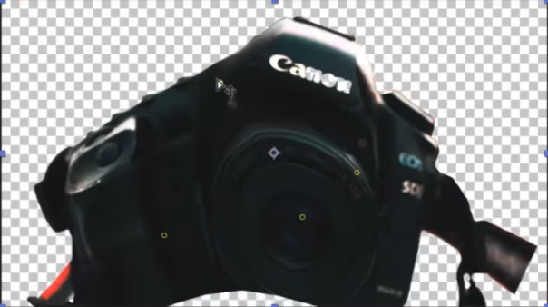

**对齐**

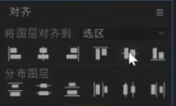

效果与PS类似，可让对象对齐或均匀排列。

### 渲染

AE渲染输出都是针对某一个合成指定的工作区。渲染输出时，需要将对应合成添加到渲染队列/添加到Media Encoder队列。

AE无法输出MP4格式，需要AME才可。

**工程打包**：使用“收集文件”功能，可以对整个AE程包括素材进行打包归档。方便迁移至其他设备继续制作。

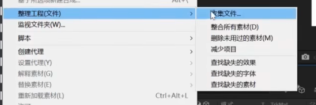

## 图层

### 文字图层

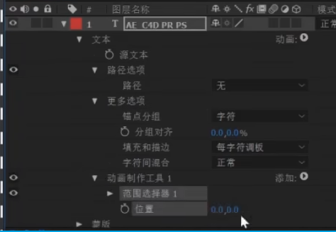

1. 文字图层可以完成各种各种文字入场，出场效果

2. 效果内置了许多文本动画预设

   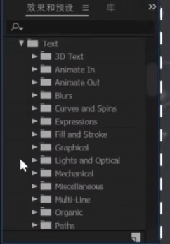

### 形状图层

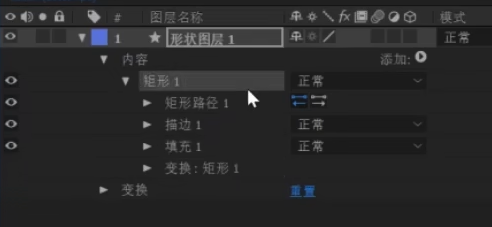

形状是在组里添加各个路径，描边和填充得到。因此可以自行创建新组，完成自定义形状及动画。

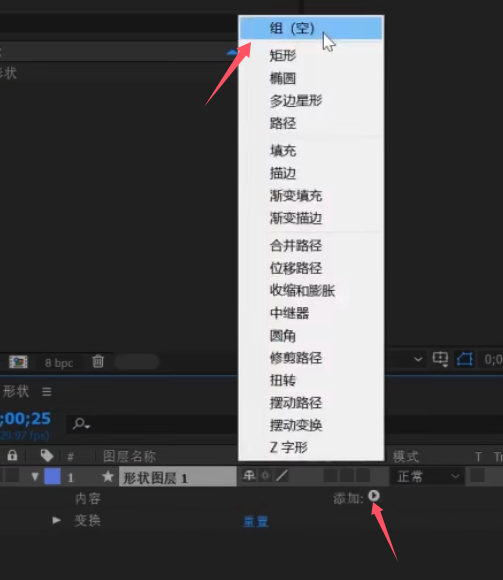

>  例子：
>
> 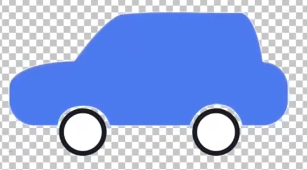

### 摄像机层

创建时，需要确定是有目标点的双节点摄像机，还是无目标点的单节点摄像机。

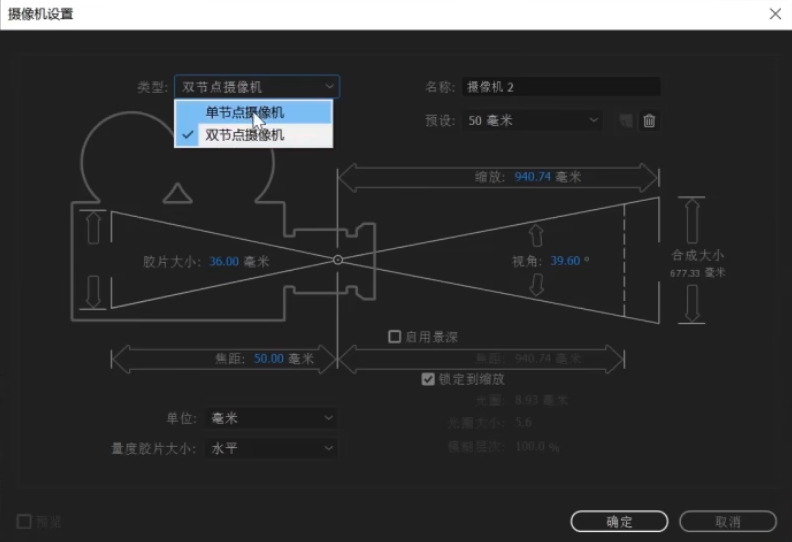

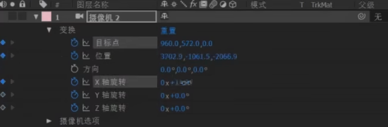

为了视觉效果，常给摄像机的位置，旋转，目标点等属性k上动画。

**空对象**

可新建一个空对象，并设置为摄像机的父图层。可以K的空对象的属性动画，从而得到平滑的摄像机镜头。

**景深**

开启景深后，只要光圈足够大，焦点正确。很容易得到唯美的背景虚化效果。

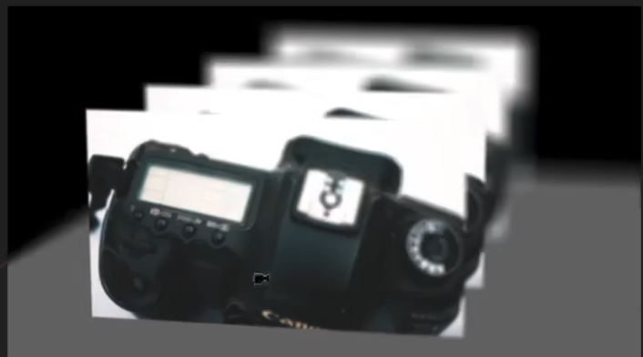

**灯光层**

用于三维空间。创建时，需要确定颜色，强度等参数。

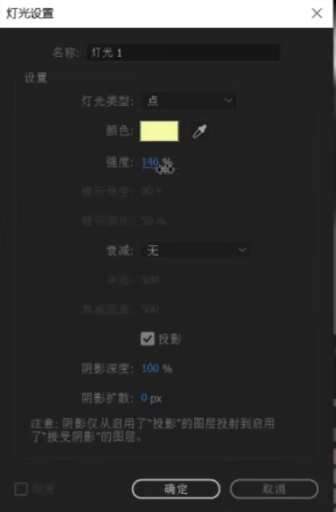

 勾选投影后，可以得到真实的投影效果。

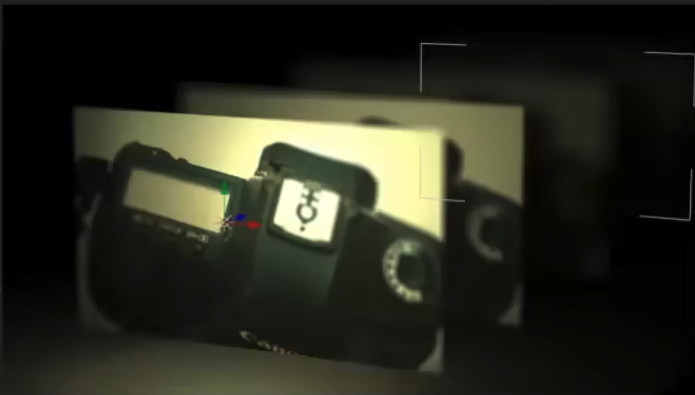

 灯光层也常被粒子插件作为发射器。

AE的灯光层和摄像机，也是AE与三维软件互导时的主角。 

# 效果

AE的效果分为内置和外置两类。

## 外置插件

- Red gaint
  1. looks, mojo：对画面进行颜色调节
  2. denoiser：去燥
  3. trapcode：
     1. 粒子插件： particular，form
     2. 线条：3d stroke
     3. 光线：shine
- RE:Vision
  1. 运动模糊：rsmb
  2. 慢放：twixtor
  3. 点线科技风格：plexus
-  Surperluminal-stardust：粒子插件
- video copilot：
  1. 3D插件：element
  2. 光效插件：optical flares
  3. 能量光线插件 saber
  4. 反射：vc reflect

## 内置插件

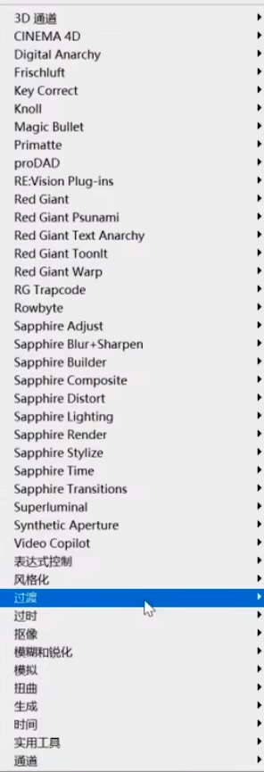

- 3D通道：过时，不常用

- CINEMA 4D：不常用

  - 目前做三维合成的主要手段，是通过三维软件分层渲染后再在AE中合，或者使用element插件完成

- 表达控制式

  - 自由控制表达式的参数，实现一些特殊的效果

- 风格化

  - 对画面风格进行风格处理

- 过渡

  - 添加转场效果

  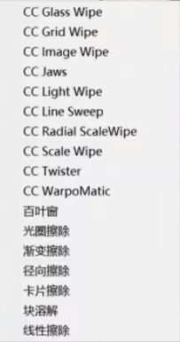

- 抠像

  - 对画面进行扣像。常用Keylight

- 模拟

  - 画面生成一些抽象比较炫酷的效果。比如粒子，碎片

    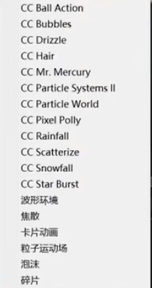

- 扭曲

  - 让画面产生扭曲或变形效果

- 生成：

  - 给图层生成一些新的效果，如描边，勾画，填充，圆形  

- 文本

- 遮罩

  - 对图层对象的边缘进行一定的处理

# 动画

AE动画主要通过K关键帧实现。

**关键帧**

为了应对不同的动画需求，关键帧也有很多的类型，默认为线性。

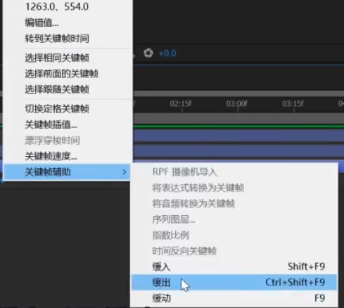

 关键帧可以复制，反转，缩放。 

  

**动画图标编辑器：**

常用速度-时间图，来调节物体的运动速度，可以让关键帧到关键帧中间有一定的速率变化。

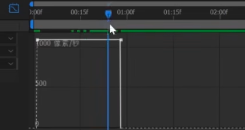

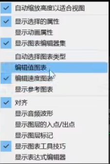

