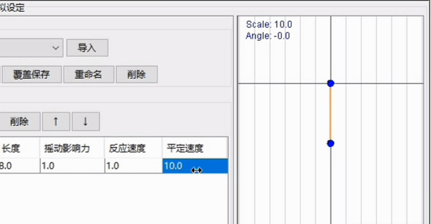

# 基础概念

## 名词解释

https://docs.live2d.com/zh-CHS/cubism-editor-manual/glossary/

## 参数

https://docs.live2d.com/zh-CHS/cubism-editor-manual/parameter/

标准参数列表：https://docs.live2d.com/zh-CHS/cubism-editor-manual/standard-parameter-list/

## 变形器

https://docs.live2d.com/zh-CHS/cubism-editor-manual/deformer/

变形器在参数的不同关键点上进行变形，完成九轴。

- 弯曲变形器：控制弯曲形变
- 旋转变形器：以某个点为圆心进行宣传

## 物理

Vtube Studio面部捕捉只能驱动标准参数。

在物理界面，设置自定义参数，如何在标准参数输入下进行波动。即自定义参数，由标准参数驱动，需要在物理界面设置。

## 图像

### 混合模式

- **正片叠底（Multiply）**：原理是将两个图层的颜色值相乘，通常会使图像变暗。
  - **效果**：任何颜色与黑色相乘结果为黑色，与白色相乘则保持不变，其他颜色会使图像整体变暗。
  - **应用**：
    - 阴影效果：常用于添加阴影或加深图像。
    - 纹理叠加：将纹理与图像结合，增强质感。
    - 颜色校正：调整图像色调和对比度。

-  **滤色（Screen）**：原理：将两个图层的反相颜色相乘，再反相结果。使图像变亮，与正片叠底相反。
     - **效果**：
       - 任何颜色与白色滤色结果为白色。
       - 任何颜色与黑色滤色保持不变。
     
     - **应用**：用于提亮图像或创建光效。
     
- **叠加（Overlay）**：作用：结合正片叠底和滤色的效果，增强对比度。

     - 原理：
       - 如果基色较暗，使用正片叠底。
       - 如果基色较亮，使用滤色。

     - 效果：
       - 保留亮部和暗部细节，中间调对比度增强。

     - 应用：常用于增强纹理或提高图像对比度。

- **柔光（Soft Light）**

     - 作用：类似叠加，但效果更柔和。

          - 原理：
            - 如果混合色较亮，图像变亮。
            - 如果混合色较暗，图像变暗。

          - 效果：
            - 类似于在图像上打了一层柔和的灯光。
     
     - 应用：用于轻微调整亮度和对比度。

- **强光（Hard Light）**

     - 作用：类似叠加，但效果更强烈。

          - 原理：
            - 如果混合色较亮，使用滤色。
            - 如果混合色较暗，使用正片叠底。

          - 效果：
            - 对比度更高，效果更强烈。
     - 应用：用于创建强烈的光照或阴影效果。

- **颜色加深（Color Burn）**

     - 作用：加深图像颜色，增强对比度。

          - 原理：通过减少亮度使颜色变暗。

          - 效果：
            - 图像暗部更暗，亮部变化较小。
     
     - 应用：用于增强阴影或创建暗调效果。

- **颜色减淡（Color Dodge）**

     - 作用：提亮图像颜色，增强亮度。

          - 原理：通过增加亮度使颜色变亮。

          - 效果：
            - 图像亮部更亮，暗部变化较小。
     
     - 应用：用于创建高光或光效。

- **线性加深（Linear Burn）**

     - 作用：通过减少亮度使图像变暗。

          - 原理：将基色和混合色相加后减去255。

          - 效果：
            - 图像整体变暗，对比度增强。
     
     - 应用：用于创建深色效果。

- **线性减淡（Linear Dodge）**

     - **作用**：通过增加亮度使图像变亮。

          - **原理**：将基色和混合色相加。

          - **效果**：
            - 图像整体变亮，对比度减弱。
     
     - **应用**：用于创建亮调效果。

- 差值（Difference）

     - 作用：显示两个图层的颜色差异。

          - 原理：取基色和混合色的绝对差值
            
          - 效果：
            - 相同颜色变为黑色，不同颜色显示为彩色。
     
     - 应用：用于对齐图层或创建抽象效果。

- 排除（Exclusion）

     - 作用：类似差值，但效果更柔和。

     - 原理：与差值类似，但对比度较低。
          - 效果：
            - 相同颜色变为灰色，不同颜色显示为彩色。
     

     - 应用：用于创建柔和的对比效果。

- 色相（Hue）

     - 作用：保留混合色的色相，使用基色的亮度和饱和度。
          - 效果：
            - 仅改变颜色，不影响亮度和饱和度。
     
     - 应用：用于调整图像色调。

- 饱和度（Saturation）

     - 作用：保留混合色的饱和度，使用基色的亮度和色相。
          - 效果：
            - 仅改变饱和度，不影响亮度和色相。
     
     - 应用：用于调整图像饱和度。

- 颜色（Color）

     - 作用：保留混合色的色相和饱和度，使用基色的亮度。
          - 效果：
            - 改变颜色和饱和度，但保留亮度。
     
     - 应用：用于着色或调整图像颜色。

- 明度（Luminosity）

     - 作用：保留混合色的亮度，使用基色的色相和饱和度。
          - 效果：
            - 改变亮度，但保留颜色和饱和度。
     
     - 应用：用于调整图像亮度。

- **变暗类**：正片叠底、颜色加深、线性加深。
- **变亮类**：滤色、颜色减淡、线性减淡。
- **对比度类**：叠加、柔光、强光。
- **特殊效果类**：差值、排除。
- **颜色调整类**：色相、饱和度、颜色、明度。

# 制作基础操作

PSD中所有的蒙版，导入Live2D后均会失效。需要逐步分别将每个部件，通过“剪贴ID”，实现蒙版效果。

## 建模操作界面

**快捷键**

套索工具和笔刷选择工具，都是用于进行不规则选取变形器的分割点。

**变形器**

1. 继承：需要删除某个变形器，但变形器的变形内容需要保留时使用。

**编辑形状：**

1. 反转：将一个部件在参数上的一端极值动作，挪到另一端极值点上。
2. 恢复原状：令一个部件恢复到最开始的样子。无法作用于变形器
3. 混合形状：对于当前已点击“复制形状”的部件的形状，与当前选择的点，以这两个点的形状为趋势，进行混合变形。

临时变形工具：当不像创建新的变形器，却希望变形器相关功能以制作。

## 参数

**四角形状合成**

对当前部件的两个参数进行四角合成。两条参数链接后，会形成两条参数的点数相乘的数量点。在未进行四角合成的时，四个角落的点，并未有任何单独动作。四角形状合成会依据已有的四个点， 合成出四个角落点的形状，依据的四个点其实是未链接前两条参数的极值。

**动作反转**

令部件或变形器进行垂直轴对称反转。作用于变形器时，依据对称轴则是变形器的中心；没有变形器时依据的对称轴则是整个画布的中心。反转并不是按照图形逻辑进行翻转，而是将对称轴一边的变形，镜像反转到另一边。一些特殊情况下，明明是对称图形，但是反转结果并不对成。

**基础参数**

- ParamAngleX：头X
- ParamAngleY：头Y
- ParamAngleZ：头Z
- ParamEyeLOpen/ParamEyeROpen：左/右眼开闭
- ParamEyeLSmile/ParamEyeRSmile：左/右眼微笑
  - 
- ParamEyeBallX：眼珠X
- ParamEyeBallY：眼珠Y
- ParamBrowLY/ParamBrowRY：左/右眉Y
- ParamBrowLX/ParamBrowRX：左/右眉X
- ParamBrowLAngle/ParamBrowRAngle：左/右眉角度，功能有点重叠，目前用的不多
- ParamBrowLForm/ParamBrowRForm：左/右眉变形
  - 
- ParamMouthForm：嘴 变形
- ParamMouthOpenY：嘴 张开和闭合
- ParamCheek：脸颊泛红（用的极少）
- ParamBodyAngleX：身体旋转X
- ParamBodyAngleY：身体旋转Y
- ParamBodyAngleZ：身体旋转Z
- ParamBreath：呼吸
  - 
- ParamHairFront摇动前发/ParamHairSide摇动侧发/ParamHairBack/摇动后发
- ParamMouthX (Input：MouthX，Webcam无此输入)：嘴X
  - 
- ParamCheekPuff（Input：ParamCheekPuff，IOS Only）：向上鼓起脸颊
  - 
- PuckerTongue（Input：Tongueout，Webcam无此输入）：吐舌

> 对于变形参数Form/Smile，-1通常是往下变形，1通常是往上变形。（MouthForm除外）。
>
> 其中，ParamMouthX与ParamCheekPuff一般只与VB一起进行制作，被计价算入VB中。

## 布点

部件默认布点：只有4个白点，用于圈定部件的整体范围。布点原则：需要保证整个部件都在布点范围内。

对简单的物件：使用自动布点，节省工作量。

对复杂/重要的物件（如五官）：使用手动补点，提高精细度。

### 自动布点

自动布点的密度较高时，可能会出现Bug，有多余的点出现（显示”网格未关闭“），从而导致部件消失。此时需要手动调整或重新生成。

可批量操作各个部件的自动布点。

### 手动布点

默认使用钢笔工具，即完全手动补点，点一个布一个。效率降低。

推荐在“工具细节”中，使用**按笔触划分网络**。 使用时，会根据我们手动画的线，自动按线的形状生成布点。

**按笔触划分网络**

可以调整布点密度。

1. **网格宽度的顶点数**：即按笔触的方向会自动生成多少排顶点，通常选择 3 及以上

2. **网路宽度**：控制各排点的间隔

   

   

3. **重复的间隔**：控制一排点中，点的密集程度。建议和网络宽度保持一致

   

   

4. 

按住“Ctrl”，可以局部调节布点密度。

布点可以一个部件复制粘贴到另一个部件，通常用于左右对称的部件。

> 如左右两个眉毛，布完一个后，可以复制粘贴 + 水平反转到另一个。

### 布点示例

上唇+嘴皮

下唇+嘴皮

空腔

睫毛

对于左右不等宽的部件，可以使用多条笔触进行布点，最后再手动连接给网络（可使用“自动连接”）。

下睫毛

对于喷枪图层，尽量多布一点。

> 对于不规则部件（特别是圆形）  ，自动布点容易出现布点确缺失，需要手动检查并补充。

**需要保证脸底色和脸线稿的布点完全一致，通常复制底色的布点到线稿中。**

## 蒙皮

 变形器路径进行蒙皮：依据规划的变形路径，将一个个完整的部件，分成成若干份并自动使用胶水黏合，**同时生成若干相关旋转变形器，并创建相关参数**，自动制作相关旋转变形。

用途：超快制作长条状物体的物理效果的。如长发，飘带，尾巴。

## 变形路径

用于控制部件的布点形变，可简单地实现网络的粗略形变。打点的数量建议为5个。

变形路径是为了方便操作部件变形，使用后可以删除。

 

  所有不使用变形器，而是直接拉伸的部件，都推荐使用变形路径，节省工作量。

## 物理

### 摆锤

摆锤是模拟物理效果幅度的视觉表现

**摇摆影响力**：控制摆锤的摇摆幅度

- 越小，摆锤越重
  - 
- 越大，摆锤越轻
  - 

**反应速度**：控制摆锤下端点和上端点的错开程度

- 越大，摆锤越僵硬

**平定速度**：控制摆錘稳定下来的速度。

- 越大，摆锤稳定得越快

眼睑

- 制作眼睑的X，Y参数
- 可由嘴巴参数、EyeOpen驱动

利用物理驱动九轴，利用物理参数，增加模型的流畅度，平滑度，增加缓冲，减少撞墙感。

- 新建自定义参数：头身XYZ
- 创建多个物理组，利用基础参数，驱动自定义头身XYZ参数

身体九轴

- 创建若干个物理组，由头XYZ，驱动身体旋转XYZ
- 创建多个物理组，由身体旋转XYZ参数，驱动所有身体参数
  - ParamBodyAngleX 驱动：身体X轴平移，双脚X移动，手部旋转，衣服旋转与物理

## 变形器

### 旋转变形器

**弯曲变形器不会使旋转变形器里的部件。**

用途：当耳环等部件，由于与耳朵等部件放置于同一变形器，制作九轴发生弯曲时，可单独对耳环创建旋转变形器（无需设置参数），从而使耳环不发生弯曲。

## 纹理集

模型导出为运行档时，需要先生成纹理集。

选择纹理大小，倍率推荐维持100%。

点击“自动编排”，Live2D进行整体排布。

整体排布存在的问题：

- 可能存在未放置的物体，可以右键由系统放置，或手动放置
- 可能存在重叠的部件纹理，需要手动调整
- 纹理集空间利用率较低，留白位置较大

> 如希望在不降低模型实际分辩率的情况下，可以选择纹理大小为2K，同时手动编排，减少纹理集的留白，提高利用率。

## VB

模型制作VB参数并开启VB后，眨眼会带来轻微的点头，Z轴范围越大越明显。目前疑似为通病。

VB参数

- ParamMouthFunnel（Input：MouthFunnel）：撅嘴
  - 
- ParamMouthShrug（Input：MouthShrug）：向上耸嘴
  - 
- ParamJawOpen（Input：JawOpen）：下巴向下
  - 
- ParamMouthPressLipOpen（Input：MouthPressLipOpen）：：向下抿嘴
  - 
- ParamMouthPucker（Input：MouthPucker）：收紧嘴巴
  - 

# 具体模型制作

## 五官

**眉毛**

标准：眉毛参数-1是向上，1的是向下的。

- -1：

- 1：

  

**眼睛**

若左右眼睛是镜像的，做完左眼后，可以直接复制一份部件并进行反转，作为右眼。（即原右眼图层可删除）。

1. 选择左眼、右眼所有部件后，创建变形器。

   1. 变形器作用：用于确定部件反转后的位置，使左眼反转后的位置，镜像并出现在脸右边。因此，创建变形器时，需要同时选择右眼，使位置在脸中间 
   2. 需要手动创建辅助线，确保变形器的位置位于正中间

   

2. 复制所有左眼的部件，粘贴到右眼文件夹中。右键选择“反转”，反转设定为“水平翻转”。

   

   

3. 复制后的部件，对应左眼的参数，选择变更到“右眼”。随后删除之前的右眼部件。

   

   

 

**嘴巴**

嘴巴参数：

- 嘴巴变形：-1为瘪嘴，0为平嘴，1为笑嘴
- 嘴张开闭合：0闭合，1张开

**嘴形参考**

嘴巴闭合时，需要将上下牙紧贴

## 头九轴

推荐**脸的每个部件，都分别创建一个单独的变形器。**

如果嘴巴需要匹配九轴，需要多个单独的嘴巴变形器。

**九轴制作步骤：**

1. 创建头XY，头Z，身体XY的旋转变形器。身体XY变形器为头Z父变形器，头Z为头XY父变形器。

   头xy，头Z，身体XY：

   

   

2. 制作脸皮5点形变

3. 对前部（五官 ，鼻子，前发，眼镜进行）统一进行位移粗调

4. 对后部（后发，侧发，耳朵）统一进行位移粗调

5. 对各个部件进行5点形变微调

6. 选择脸皮和各个部件，进行头XY四角合成

7. 对各个部件进行4角形变微调

假如部件是左右对称，做完一边的参数后，可以使用“动作反转”，反转当前形变至另一边。

# 常见问题

**部件/变形器弯曲的部件恢复原状**

直接变形后的部件：点击此按键，可将直接变形后的部件，恢复原状。

变形器弯曲的部件

1. 如某些参数关键帧上存在正常形状，则拉至此关键帧，随后删除错误的关键帧，再重新新建
2. 如所有参数关键帧上的都不存在正确形状，则删除变形器，对其下所有部件使用“恢复原状”按键。

# Vtube Studio

Lip Sync：https://www.youtube.com/watch?v=oJCkqsQ_x_U

# 疑问：

动态轴和静态轴。

变形路径
