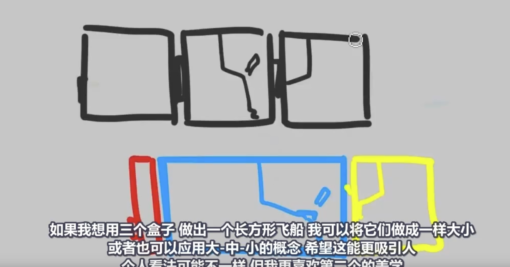

# 设计原则

并不是一定需要遵循设计原则，才可以设计出好的作品。实际上，很多情况下是需要违反设计原则才更美观。

# 颜色的基本三要素

| 要素                   | 中文        | 决定什么           | 举例                              |
| ---------------------- | ----------- | ------------------ | --------------------------------- |
| **Hue**                | 色相        | 决定颜色“种类”     | 红、橙、黄、绿、青、蓝、紫        |
| **Saturation**         | 饱和度      | 决定颜色“是否鲜艳” | 鲜红（高饱和） vs. 灰红（低饱和） |
| **Brightness / Value** | 明度 / 亮度 | 决定颜色“亮还是暗” | 粉红（高亮度） vs. 酒红（低亮度） |

- HSV 模型（Hue, Saturation, Value） → 用于设计、绘图；
- HSB 模型（Hue, Saturation, Brightness）→ 多见于 Photoshop；
- HSL 模型（Hue, Saturation, Lightness）→ 用于网页和 CSS。

它们本质是**相近的三维色彩模型**，只是最后一个维度的定义略有差异（亮度 vs 明度 vs 光度）。

# 大中小

假如将一堆大小相同的形状放在一次，总是很难得出满意设计。可以考虑将形状分别设置为大、中、小，可以一定程度提高画面。

> 此例子中，红色代表小，黄色代表中，蓝色代表大。

我们的大脑喜欢秩序，所以**形状层次结构**，总是具有一个基本的吸引力。

如果计算每一个形状的面积，你可能会发现皮卡丘正好代表了**完美的黄金比例，每个较大的面积是相对较小面积的1.618倍**。

> 人体黄金比例：
>
> 
>
> 

例子：对于这把手枪来说， 对于主体部分的枪管来说，如果面积大小和下面的部分是相近的，会更没有设计上的美感。

如果看到小部分面积过多，那么就需要进行调整。

# 概念对比

作为艺术家，我们知道对比就是在不同值之间形成反差，这是艺术中一个极其重要的的方面。我们也可以将其应用到其它方面，比如设计理念。

激光剑，是概念对比中最清晰易懂的例子：它包含了一些历史题材的东西，比如剑，然后与科幻概念激光结合在一起。

**概念对比是创建有趣和独特概念的世界构建、个人设计的最简单方法.**

> 只是要小心运用，就像大多数事情一样。尽可能不要太过。**在一幅画中，适当的对比可以产生聚焦，但对比太多就会变得混乱。

>  例子：西方现代生活，与日式古代建筑和武士。武士穿着运动鞋，背包有耐克logo，牵着柴犬。
>
> 